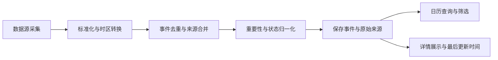

# Dibobo 事件日历功能 PRD

| 文档属性 | 内容 |
|---|---|
| 产品名称 | Dibobo |
| 功能名称 | 事件日历（Event Calendar） |
| 文档版本 | V1.0 |
| 需求状态 | 已完成需求梳理，待开发前确认 |
| 文档日期 | 2026-08-09 |
| 目标终端 | PC Web |
| 默认时区 | Asia/Shanghai（北京时间） |
| 数据策略 | 免费数据源优先，官方源为主，开源/免费 API 补充 |

## 1. 文档目的

本文档定义 Dibobo“事件日历”功能的产品目标、用户场景、事件范围、数据源策略、页面交互、数据规则、异常处理、非功能要求和验收标准。

本文档作为产品、交互、前端、后端、数据接入和测试工作的共同基线。技术实现可以调整，但不得改变本文档已确认的用户行为、数据口径和验收结果。

## 2. 产品背景与定位

### 2.1 背景

用户需要在同一时间轴上了解可能影响全球和全国金融经济市场的重要事件，包括：

- 国家及地区发布的经济数据；
- CPI、PPI、GDP、PMI、非农等核心宏观指标；
- 央行议息、利率决议和货币政策；
- 政府政策、监管文件、税收、关税、制裁和政策生效；
- 重大国际经济、地缘政治及突发政策事件；
- 投资组合持仓股票的财报、分红、拆股、股东会等公司事件；
- 交易所休市、节假日和交易时间调整。

### 2.2 产品定位

事件日历是 Dibobo 的全球金融经济事件聚合和查看入口，以“宏观经济事件为核心、持仓公司事件为补充”。

日历页面本身不依赖用户手动选择投资组合。宏观、政策和市场事件独立展示；股票公司事件由系统后台自动限制为当前所有投资组合持仓股票的并集。

### 2.3 产品目标

1. 通过月、周、列表三种视图展示全球主要经济体的金融经济事件。
2. 支持任意日期范围查询，并同时覆盖历史事件和未来预定事件。
3. 让用户快速看到事件时间、重要性、预测值、实际值、前值和原始来源。
4. 只展示投资组合中的股票公司事件，降低无关财报噪声。
5. 以免费官方数据源为主，保留可扩展的数据源适配能力。
6. 对预计、已确认、已发布、已修订、已取消和待核实事件进行明确标识。

## 3. 用户与使用场景

### 3.1 目标用户

已经在 Dibobo 中维护投资组合，并希望跟踪宏观经济、政策和持仓公司事件的个人投资者。

### 3.2 核心使用场景

#### 场景 A：查看本月宏观事件

用户打开事件日历，默认查看当前月份，快速了解本月 CPI、非农、GDP、央行议息和重要政策发布时间。

#### 场景 B：查看某一段历史或未来时间

用户输入任意开始日期和结束日期，以列表或日历形式查看该时间段的所有事件。

#### 场景 C：查看持仓股票财报

用户查看日历时，系统自动从所有投资组合中取出当前持仓股票，并展示这些股票的财报、分红、拆股、股东会等事件。不需要用户在日历页面选择投资组合。

#### 场景 D：查看政策发布时间和生效时间

用户点击政策事件，查看文件发布时间、生效时间、发布机构、政策摘要和原文链接。

#### 场景 E：识别数据可信程度

用户可以通过重要性、事件状态、来源和最后更新时间判断事件信息是否已确认、是否可能发生变更。

## 4. 产品范围

### 4.1 本版本包含

- 月视图、周视图、列表视图；
- 任意日期范围查询；
- 全球主要经济体事件；
- 宏观经济、政策、市场日历、突发事件和持仓公司事件；
- 国家/地区、事件类型、重要性、状态、关键词筛选；
- 事件卡片和详情面板；
- 北京时间展示及事件当地时间补充；
- 实际值、预测值、前值、修正值、发布时间和来源信息；
- 当前投资组合持仓股票自动关联；
- 数据源优先级、去重、冲突和异常提示；
- 免费数据源优先接入策略。

### 4.2 本版本不包含

- 邮件、短信、浏览器推送或其他事件提醒；
- 自动生成“利好/利空”判断；
- 个性化投资建议或交易建议；
- 根据持仓金额计算事件重要性；
- 自动下单或券商连接；
- 需要购买商业数据源才能实现的实时级全球完整覆盖承诺；
- 用户在日历页面手动选择投资组合；
- 展示所有全球上市公司财报；
- 对未经确认的新闻事件进行确定性结论。

## 5. 市场与地区范围

第一阶段覆盖以下主要经济体和地区：

- 中国大陆；
- 中国香港；
- 美国；
- 欧盟；
- 英国；
- 日本；
- 加拿大；
- 澳大利亚；
- 韩国；
- 印度；
- 瑞士；
- 新加坡。

系统数据模型和筛选器应允许后续增加其他国家和地区。免费源实际可提供的事件范围可能因国家、事件类型和数据源而不同，页面必须通过来源和数据状态反映这种差异。

## 6. 事件分类

### 6.1 宏观经济事件

包括但不限于：

- CPI、核心 CPI、PPI；
- GDP、工业增加值、固定资产投资；
- PMI、制造业和服务业数据；
- 非农就业、失业率、工资和就业数据；
- 零售销售、消费者信心、房地产数据；
- 贸易、进出口、经常账户；
- 工业生产、库存、订单；
- 外汇储备、货币供应量、信贷数据；
- 其他主要统计机构定期发布的金融经济指标。

### 6.2 货币与财政政策事件

- 央行议息会议；
- 利率决议；
- 公开市场操作；
- 降准、降息和流动性安排；
- 央行会议纪要和新闻发布会；
- 财政政策、税收政策和预算；
- 关税、贸易限制和制裁；
- 重大金融稳定措施。

### 6.3 政府与监管文件

- 法律、法规和规章；
- 政府部门政策文件；
- 监管机构通知、公告和指导意见；
- 征求意见稿和实施细则；
- 上市公司监管规则；
- 重大行业政策；
- 政策发布后的生效事件。

### 6.4 持仓股票公司事件

只展示当前所有投资组合持仓股票的公司事件，包括：

- 财报发布日期；
- 季报、半年报、年报；
- 业绩预告、业绩快报和盈利预警；
- 财报电话会或业绩说明会；
- 分红、除权除息、股息支付；
- 拆股、合股、配股、增发和回购；
- 股东大会和董事会会议；
- 并购、重组、重大资产交易；
- 停牌和复牌；
- 重大监管处罚或公司公告；
- IPO 等与持仓股票直接相关的公司事件。

股票事件不展示非投资组合持仓股票的事件。

### 6.5 市场日历事件

- 交易所休市；
- 国家或地区法定节假日；
- 交易时间调整；
- 临时停市或交易规则调整。

市场休市事件作为独立事件类型展示，不与宏观经济事件共用普通重要性评级。

### 6.6 突发事件

- 突发政策；
- 重大监管动作；
- 重大国际经济事件；
- 地缘政治事件；
- 可能影响金融市场的重大新闻事件。

通过新闻或 GDELT 等非官方来源发现、但尚未被权威来源确认的事件，必须标记为“待核实”。

## 7. 事件状态

事件状态统一为：

| 状态 | 含义 |
|---|---|
| `scheduled` | 已安排但尚未发生的预定事件 |
| `confirmed` | 发布机构或公司已经确认日期/时间 |
| `published` | 事件或文件已经正式发布 |
| `effective` | 政策或规则已经生效 |
| `revised` | 事件时间或数据值发生修订 |
| `cancelled` | 原定事件被取消 |
| `unverified` | 由非官方或单一新闻来源发现，尚未确认 |
| `stale` | 数据源长期未同步，当前记录可能过期 |

一个事件可以同时包含发布时间和生效时间。政策文件至少需要区分：

- `published_at`：文件正式公开时间；
- `effective_at`：政策或规则开始生效时间。

## 8. 重要性判定

重要性表示事件对市场整体的潜在影响，不根据用户持仓金额、持仓占比或个人收益计算。

### 8.1 判定优先级

1. 优先采用数据源提供的影响等级；
2. 多个数据源的等级进行标准化；
3. 数据源没有等级时，使用固定事件规则兜底；
4. 未确认的突发事件优先标记“待核实”，不直接赋予高重要性。

### 8.2 统一等级

| 等级 | 典型事件 |
|---|---|
| 高 | CPI、GDP、非农、失业率、利率决议、重大国家政策、重大财报、重大并购、破产、重大监管处罚 |
| 中 | PMI、贸易、零售、工业生产、央行会议纪要、分红、拆股、回购、股东会、部委政策 |
| 低 | 次要指标、地区性数据、普通公告、一般性政策通知、非重大修正 |
| 待核实 | 仅由单一新闻源或新闻聚合源发现但尚未获得权威确认的事件 |

### 8.3 展示规范

- 高：红色标识；
- 中：橙色标识；
- 低：灰色标识；
- 待核实：紫色或虚线标识；
- 市场休市：使用独立的休市/交易调整标识。

重要性颜色不能作为唯一信息，卡片和详情必须同时显示文字等级。

## 9. 页面与交互需求

### 9.1 页面路由

事件日历使用现有路由：

```text
/calendar
```

### 9.2 默认状态

用户首次进入页面时：

- 默认展示当前月份；
- 使用北京时间作为日历主时间；
- 默认展示全部支持的国家/地区；
- 默认展示全部事件类型；
- 默认展示全部重要性；
- 默认展示全部事件状态；
- 默认包含所有投资组合当前持仓股票的公司事件。

### 9.3 视图

#### 月视图

- 以月为单位展示事件分布；
- 每个日期单元格展示当天事件摘要；
- 同一天事件较多时允许展开或跳转到当天列表；
- 事件使用颜色、标签和类型图标区分。

#### 周视图

- 以周为单位展示事件时间分布；
- 展示北京时间；
- 对有明确发布时间的事件展示时间点；
- 对只有日期没有具体时间的事件展示“时间待定”或等价状态。

#### 列表视图

- 适合任意日期范围；
- 按事件时间升序排列；
- 支持按重要性和事件类型快速浏览；
- 适合查看大量事件和历史事件。

### 9.4 日期范围

- 支持用户输入任意开始日期和结束日期；
- 开始日期不得晚于结束日期；
- 日期范围查询不限制为自然月；
- 无具体时间的事件按当地日期转换到北京时间后归属日期；
- 查询结果必须标注数据源实际支持的历史/未来范围，不能暗示免费源提供无限历史或无限未来数据。

### 9.5 筛选器

提供以下筛选条件：

| 筛选器 | 规则 |
|---|---|
| 国家/地区 | 支持单选或多选，默认全部 |
| 事件类型 | 支持宏观、政策、公司、市场、突发等多选，默认全部 |
| 重要性 | 高、中、低、待核实，可多选，默认全部 |
| 事件状态 | 预计、已确认、已发布、已修订、已取消、待核实等，可多选 |
| 关键词 | 搜索事件名称、股票名称、代码、发布机构和政策标题 |

不提供投资组合筛选器。公司事件的股票范围由后台自动取所有投资组合当前持仓股票的并集。

### 9.6 事件卡片

事件卡片至少展示：

- 事件名称；
- 国家/地区；
- 事件类型；
- 北京时间；
- 重要性文字和颜色；
- 事件状态；
- 股票事件的股票简称和代码；
- 宏观事件的预测值、前值或实际值（数据源有提供时）。

### 9.7 事件详情

点击事件后打开详情面板、抽屉或详情页，至少展示以下字段。

#### 通用字段

- 事件名称；
- 事件类型和子类型；
- 国家/地区；
- 市场或交易所；
- 北京时间；
- 事件当地时间；
- 重要性；
- 当前状态；
- 发布机构；
- 来源名称；
- 原始来源链接；
- 最后更新时间；
- 数据同步状态。

#### 宏观字段

- 指标名称；
- 数据所属期间；
- 实际值；
- 预测值；
- 前值；
- 修正值；
- 单位；
- 数据发布机构。

#### 政策字段

- 文件标题；
- 文件类型；
- 发布机构；
- 发布日期；
- 生效日期；
- 政策摘要或来源提供的摘要；
- 原文链接；
- 是否已经权威确认。

#### 公司事件字段

- 股票名称、代码、交易所；
- 事件类型；
- 财报所属期间；
- 预计或正式发布日期；
- 开盘前、收盘后或盘中发布状态；
- EPS、营收实际值和预测值（数据源有提供时）；
- 分红、拆股或股东会的具体日期；
- 公司公告或交易所来源链接。

## 10. 投资组合与公司事件关联

### 10.1 关联方式

事件日历页面不展示投资组合选择器，也不要求用户主动关联投资组合。

后端在查询公司事件时：

1. 获取当前用户所有投资组合中的当前持仓；
2. 对股票代码、交易所和统一标识进行标准化；
3. 合并同一股票；
4. 查询这些股票的公司事件；
5. 将事件与股票关联展示。

### 10.2 当前持仓口径

历史日期查询也按“当前所有投资组合持仓股票”筛选。也就是说：

- 当前持有的股票可以查看其历史公司事件；
- 已经卖出的股票不再出现在公司事件结果中；
- 后续如果需要“按历史时点持仓”查询，作为独立扩展功能处理。

### 10.3 股票标识

系统需要支持并尽量统一以下标识：

- A 股：如 `600519.SH`；
- 港股：如 `0700.HK`；
- 美股：如 `AAPL`；
- ISIN、FIGI、CIK 等供应商标识（数据源支持时）。

股票事件不能只依赖公司简称匹配，必须优先使用交易所、代码和标准化证券标识。

## 11. 数据源策略

### 11.1 总体原则

- 免费源优先；
- 官方源优先于第三方源；
- 开源项目作为采集或补充工具，不等同于拥有数据再分发权；
- API Key 只存储在后端配置中；
- 数据源链接和来源名称必须保留；
- 免费数据可能存在配额、延迟、覆盖范围和商业展示限制。

### 11.2 宏观与政策数据源

#### 中国大陆

- [国家统计局发布日程](https://www.stats.gov.cn/sj/fbrc/bnxxfb/)；
- [国家数据](https://data.stats.gov.cn/)；
- [中国人民银行](https://www.pbc.gov.cn/)；
- [中国政府网政策库](https://sousuo.www.gov.cn/zcwjk/)；
- 各部委官网及 RSS。

#### 美国

- [BLS API及发布日程](https://www.bls.gov/bls/api_features.htm)；
- [BEA发布日程](https://www.bea.gov/news/schedule)；
- [BEA API](https://apps.bea.gov/api/signup/)；
- [美联储FOMC日历](https://www.federalreserve.gov/monetarypolicy/fomccalendars.htm)；
- [SEC EDGAR开发者资源](https://www.sec.gov/about/developer-resources)。

#### 欧洲及其他主要经济体

- [Eurostat API](https://ec.europa.eu/eurostat/web/user-guides/data-browser/api-data-access/api-introduction)；
- [ECB API](https://data.ecb.europa.eu/help/api/data)；
- OECD、IMF及各国官方统计机构；
- 英国 ONS、加拿大统计局、日本 e-Stat、日本 JPX、香港政府统计处等官方源。

#### 政策与突发事件

- [Federal Register API](https://www.federalregister.gov/developers/documentation/api/v1)；
- [EUR-Lex Webservice/RSS](https://eur-lex.europa.eu/content/help/data-reuse/webservice.html?locale=en)；
- 各国政府、央行、监管机构官网；
- [GDELT Cloud API](https://docs.gdeltcloud.com/api-reference/v2)作为突发事件候选发现源。

### 11.3 公司事件数据源

- A 股：AKShare、上交所、深交所、巨潮资讯、Tushare Pro；
- 港股：HKEXnews、HKEX发行人信息源；
- 美股：SEC EDGAR、Alpha Vantage、Finnhub、yfinance；
- 其他市场：各交易所公告、公司 Investor Relations 页面、yfinance 等补充源。

### 11.4 免费源限制

系统不得假设免费源具备：

- 全球所有国家的完整覆盖；
- 无限历史数据；
- 无限未来预测数据；
- 实时级更新；
- 允许任意商业再分发。

上线前需要单独核验每个源的 API 条款、调用额度、展示授权和抓取限制。

## 12. 数据生命周期与更新策略

### 12.1 事件生命周期



### 12.2 更新频率

- 宏观事件和政策文件：每日更新；
- 股票财报、公告和公司事件：尽量按小时更新；
- 突发事件：根据免费来源能力尽量接近实时，但必须显示实际同步时间；
- 交易所休市和市场日历：每日或按官方日历变更更新；
- 用户进入页面时读取已同步数据，不应直接依赖浏览器请求第三方数据源。

### 12.3 时间处理

- 数据库存储统一使用 UTC 时间或带时区时间；
- 页面日历统一转换为 `Asia/Shanghai`；
- 详情同时展示事件当地时间；
- 无具体时间的事件只展示当地日期和“时间待定”；
- 夏令时由时区库处理，不允许手工固定时差。

## 13. 数据去重与冲突处理

### 13.1 去重依据

事件去重优先使用：

- 供应商事件 ID；
- 标准化事件类型；
- 国家/地区；
- 股票标准化标识；
- 事件日期和时间；
- 事件名称或指标名称；
- 报告期或政策文件编号。

### 13.2 数据源优先级

默认优先级：

1. 官方政府、央行、交易所、监管机构和公司公告；
2. 有授权的结构化数据源；
3. 开源数据封装；
4. 新闻聚合和网页抓取源。

### 13.3 冲突处理

- 相同事件多源数据自动合并；
- 官方来源的日期和值优先；
- 不同来源存在差异时保留来源记录和原始值；
- 页面展示统一值时必须允许用户查看来源；
- 不得静默覆盖冲突值；
- 只有非官方来源发现的突发事件必须标记“待核实”。

## 14. 数据异常与降级策略

必须覆盖以下情况：

- API Key 缺失或失效；
- 数据源接口超时；
- 数据源达到调用限额；
- 数据源返回格式变化；
- 官方源和第三方源日期不一致；
- 实际值、预测值或前值缺失；
- 事件发布时间未知；
- 事件被修订或取消；
- 股票代码无法映射；
- 政策文件只提供网页但没有结构化字段；
- 新闻事件尚未获得权威确认。

处理原则：

1. 页面继续展示可用数据；
2. 缺失字段显示“暂无数据”；
3. 不以 0 或空字符串伪造缺失值；
4. 显示来源和最后同步时间；
5. 使用缓存时标记为“可能已过期”；
6. 记录后端日志供排查，但不向用户暴露敏感信息；
7. 事件源完全不可用时不影响日历页面和持仓基础数据加载。

## 15. 数据模型建议

### 15.1 `calendar_events`

| 字段 | 说明 |
|---|---|
| `id` | 内部事件 ID |
| `canonical_key` | 用于跨源去重的标准化键 |
| `category` | 宏观、政策、公司、市场、突发 |
| `event_type` | 具体事件类型 |
| `title` | 事件名称 |
| `country_code` | 国家/地区编码 |
| `market` | 市场或交易所 |
| `security_id` | 关联证券标准标识，可为空 |
| `scheduled_at` | 预定时间 |
| `published_at` | 正式发布时间 |
| `effective_at` | 政策生效时间 |
| `timezone` | 事件来源时区 |
| `status` | 事件状态 |
| `importance` | high、medium、low、unverified |
| `period` | 数据所属期间 |
| `actual_value` | 实际值 |
| `forecast_value` | 预测值 |
| `previous_value` | 前值 |
| `revised_value` | 修正值 |
| `unit` | 单位 |
| `issuer` | 发布机构 |
| `summary` | 来源摘要或结构化摘要 |
| `source_name` | 来源名称 |
| `source_url` | 原始来源链接 |
| `last_synced_at` | 最后同步时间 |
| `created_at` | 创建时间 |
| `updated_at` | 更新时间 |

### 15.2 `calendar_event_sources`

用于保存一个规范事件对应的多个来源：

- `event_id`；
- `provider`；
- `provider_event_id`；
- `raw_payload` 或原始数据引用；
- `source_url`；
- `provider_importance`；
- `observed_at`；
- `is_authoritative`；
- `created_at`。

### 15.3 投资组合关联查询

事件日历不需要把 `portfolio_id` 写入事件主表。公司事件查询时，动态获取当前用户所有组合中的当前持仓股票并进行过滤。

## 16. API 边界建议

实际命名应遵循项目现有 API 风格，建议至少包含：

| 方法 | 路径 | 说明 |
|---|---|---|
| `GET` | `/api/calendar/events` | 按日期范围和筛选条件查询事件 |
| `GET` | `/api/calendar/events/{event_id}` | 获取事件详情及来源 |
| `GET` | `/api/calendar/filters` | 获取国家、类型、状态和重要性选项 |
| `GET` | `/api/calendar/sync-status` | 获取数据源最后同步状态 |

查询参数建议支持：

- `from`；
- `to`；
- `countries`；
- `categories`；
- `event_types`；
- `importance`；
- `statuses`；
- `keyword`；
- `view`。

后端必须从当前登录用户会话中确定用户身份，不信任前端传入用户 ID。

## 17. 非功能要求

### 17.1 性能

- 月视图常规查询应优先命中标准化事件缓存；
- 列表视图支持任意日期范围，但应采用分页或游标避免一次返回过量数据；
- 查询事件时不得为每个事件逐一请求第三方接口；
- 投资组合持仓股票应批量标准化和批量查询；
- 事件详情加载不应阻塞日历主视图。

### 17.2 可用性

- 数据源异常不应导致整个日历页面白屏；
- 未配置某一数据源时，其他可用事件源仍可展示；
- 页面必须区分“没有事件”和“数据加载失败”；
- 事件来源链接在新标签页打开或提供明确跳转操作。

### 17.3 安全

- API Key 只能保存在后端环境变量或安全配置中；
- 前端不得直接暴露供应商密钥；
- 日志不得记录 API Key、用户密码或完整授权头；
- 所有事件查询必须经过用户身份校验；
- 事件详情不能跨用户泄露持仓股票信息；
- 需要遵守各数据源的访问频率、使用和展示条款。

### 17.4 可观测性

数据同步任务至少记录：

- 数据源名称；
- 开始和结束时间；
- 成功、失败和部分成功状态；
- 获取事件数量；
- 新增、更新、合并和取消数量；
- 最后成功时间；
- 错误类型；
- 是否使用缓存降级。

## 18. 验收标准

### 18.1 日历与日期范围

1. `/calendar` 页面可以正常进入。
2. 月视图、周视图和列表视图均可切换。
3. 默认打开当前月份、北京时间和全部事件。
4. 用户可以输入任意合法日期范围查询。
5. 开始日期晚于结束日期时显示明确校验错误。
6. 事件按北京时间正确归属日期。
7. 详情中可以看到事件当地时间。

### 18.2 事件展示

1. 宏观、政策、公司、市场和突发事件可以区分展示。
2. 事件卡片包含名称、时间、地区、类型、重要性和状态。
3. 事件详情包含来源链接和最后更新时间。
4. 宏观事件支持实际值、预测值、前值和修正值展示。
5. 政策事件同时展示发布日期和生效日期。
6. 公司事件展示股票标识和对应事件信息。
7. 市场休市使用独立标识。
8. 未确认突发事件显示“待核实”。

### 18.3 持仓股票范围

1. 日历页面不提供投资组合筛选器。
2. 宏观、政策和市场事件不受投资组合影响。
3. 公司事件只来自当前所有投资组合持仓股票。
4. 非持仓股票的公司事件不展示。
5. 同一股票出现在多个投资组合时，公司事件只展示一次。
6. 股票代码、交易所和名称匹配正确。

### 18.4 筛选和排序

1. 国家/地区筛选有效。
2. 事件类型筛选有效。
3. 重要性筛选有效。
4. 事件状态筛选有效。
5. 关键词搜索可以匹配事件名称、股票名称、代码和发布机构。
6. 多个筛选条件之间使用 AND 关系。
7. 清空筛选条件后恢复全部事件。

### 18.5 重要性与状态

1. 数据源有评级时按统一规则展示高、中、低。
2. 数据源无评级时使用固定事件规则兜底。
3. 重要性颜色和文字一致。
4. 预计、已确认、已发布、已修订、已取消、待核实和过期状态可区分。

### 18.6 更新与异常

1. 宏观和政策事件按每日同步策略更新。
2. 股票事件按尽量每小时的策略更新。
3. 页面展示最后同步时间。
4. 数据源失败时保留最后成功数据并标记可能过期。
5. 缺失值显示“暂无数据”，不显示为 0。
6. 多源冲突时官方源优先且保留来源信息。
7. 数据源未配置或额度耗尽时，页面显示可理解的状态，不白屏。
8. 突发事件未确认时不得被展示为正式确定事件。

### 18.7 范围约束

1. 第一版不包含提醒功能。
2. 第一版不包含自动利好/利空判断。
3. 第一版不包含个性化投资建议。
4. 第一版不要求覆盖所有国家的全部事件，也不承诺免费源实时完整覆盖。

## 19. 后续可扩展方向

- 浏览器、邮件或消息推送；
- 用户自定义事件提醒；
- 事件影响的中性解释和历史统计；
- 按历史时点持仓查询公司事件；
- 更多国家和交易所；
- 商业聚合数据源切换；
- 组合持仓与事件影响的个性化关联；
- 事件导出为 ICS、CSV 或其他格式；
- 事件历史结果、预测偏差和修正趋势分析。

## 20. 开发前最终确认

本 PRD 已包含已确认的产品范围和验收标准。开发前必须确认：

- 不增加未列出的提醒功能；
- 不将非持仓股票的公司事件加入日历；
- 不将 AI 生成的利好/利空判断作为 V1 结果；
- 免费数据源的覆盖和授权限制在页面中真实反映；
- 需求变更必须同步更新本文档和验收标准。

