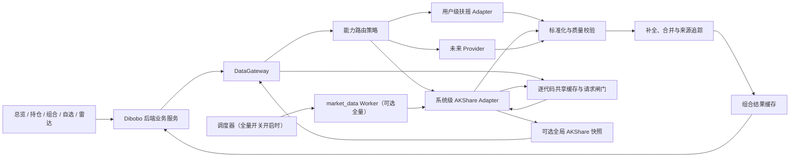
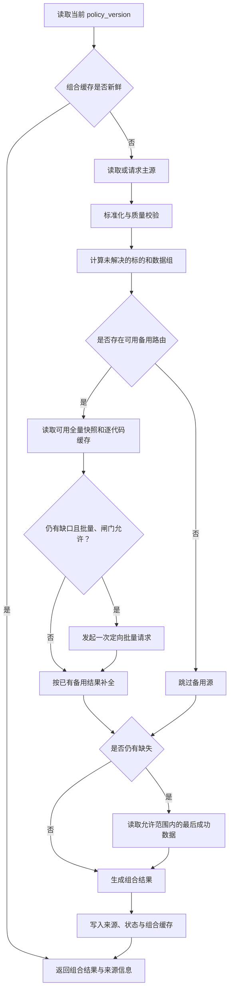

# Dibobo 多数据源网关与自动补全 PRD

| 文档属性 | 内容 |
|---|---|
| 产品名称 | Dibobo |
| 功能名称 | 多数据源网关与自动补全 |
| 文档版本 | V1.1 |
| 需求状态 | 方案已确认，按需补全方案开发中 |
| 文档日期 | 2026-08-11 |
| 目标市场 | 中国 A 股；现有 ETF 能力保持不变 |
| 影响范围 | 数据源适配层、总览、持仓、投资组合、自选、红利雷达、系统设置、缓存、后台任务、部署与监控 |
| 相关文档 | `Dibobo-V1-PRD.md`、`Dibobo-Portfolio-Management-PRD.md`、`Dibobo-Watchlist-Management-PRD.md` |

> 本功能的目标是在可用、同口径、合规的数据源范围内最大化数据覆盖，并消除“静默缺失”。系统不承诺第三方永远提供完整数据；所有最终仍无法补全的数据必须明确展示缺失原因、来源状态和数据时间，不得伪造或静默混合。

## 1. 文档目的与变更关系

本文档定义 Dibobo 全局多数据源网关、能力级路由、自动补全、数据质量、来源追踪、缓存、后台采集、异常降级、分阶段发布和验收标准。

本文档作为产品、后端、前端、数据接入、测试和部署工作的共同需求基线。技术实现可以在不改变本文档业务规则、数据口径和验收结果的前提下调整。

### 1.1 对既有需求的专项变更

本 PRD 经评审确认后，对以下既有规则形成专项替代；发生冲突时以本 PRD 为准：

1. `Dibobo-V1-PRD.md` 第 2.4 节中“不包含多数据源自动切换或同一结果中混合多源数据”；
2. `Dibobo-V1-PRD.md` 第 6.4.4 节中扶摇缺少总市值能力时禁用相关筛选的规则；
3. `Dibobo-V1-PRD.md` 第 6.6.2 节中数据源之间不自动故障切换的规则；
4. `Dibobo-V1-PRD.md` 第 10.4 节中“数据源失败时不自动切换到其他数据源”；
5. `Dibobo-V1-PRD.md` 第 13.4 节中“当前数据源不支持总市值时禁用总市值筛选”；
6. `Dibobo-V1-PRD.md` 第 13.6 节中“V1 不提供自动故障切换”；
7. `Dibobo-V1-PRD.md` 第 14 节发布检查清单中与“缺失总市值时禁用”或“不得自动切换”相同含义的检查项。

以下既有规则继续有效：

- 每个用户同时只启用一个用户级主数据源；
- 用户主数据源的 API Key 继续加密保存并按用户隔离；
- 本地持仓、自选、组合和日记数据不依赖外部数据源可用性；
- 最后成功数据必须明确标记 stale，不得伪装为实时数据；
- 本次改造不擅自增加现有页面未定义的主要展示字段。

系统级备用源不属于用户的“启用数据源”，因此不违反“一名用户一个主源”的产品规则。

## 2. 背景与问题定义

### 2.1 当前状态

Dibobo 当前以用户启用的扶摇或扶摇兼容接口作为唯一业务数据源。项目已经具备代码级适配器和统一领域模型，但总览、持仓、雷达等业务仍直接创建扶摇适配器，缓存、任务和状态也围绕单一数据源组织。

扶摇当前明确不支持总市值，导致红利雷达无法使用总市值筛选。其他能力也可能出现以下情况：

- 某项能力完全不支持；
- 某只标的不在数据源覆盖范围；
- 返回记录存在部分字段缺失；
- 数据暂未就绪；
- 上游超时、限流或临时不可用；
- 上游字段、单位或响应结构发生变化；
- 最后成功缓存存在，但新鲜数据暂不可得。

现有单源模式无法在这些情况下自动使用其他来源补全，也无法准确说明一个混合结果中每个字段来自哪里。

### 2.2 核心问题

本功能需要解决的不是“给每个页面加一个 AKShare 调用”，而是建立全局统一的数据获取机制：

1. 业务模块不感知具体 Provider；
2. 系统按数据能力选择主源和备用源；
3. 主源缺失或异常时自动使用备用源；
4. 不同口径或不同时点的数据不得被错误拼接；
5. 所有字段的来源、时间、状态和补全原因可追踪；
6. 未来增加其他 Provider 时不修改业务模块；
7. 备用源异常不得拖垮主业务请求。

### 2.3 产品结论

采用“用户级扶摇主源 + 系统级 AKShare 备用源 + 全局 DataGateway + 能力级路由策略”的方案。

固定数据优先级为：

```text
新鲜主源数据
→ 新鲜备用源数据
→ 允许范围内的最后成功数据
→ 明确缺失
```

## 3. 产品目标与成功标准

### 3.1 产品目标

1. 对任一 Provider 已返回且通过质量校验的有效数据，网关不得丢失；
2. 主源不支持、缺记录、缺字段或临时异常时，自动使用已启用的备用源补全；
3. 所有仍无法补全的数据都具备可理解的缺失状态；
4. 所有参与最终结果的数据都可以追踪到 Provider、真实上游、接口、数据时间和策略版本；
5. 首期正式补全 A 股总市值，并恢复红利雷达总市值筛选；
6. 建立可继续接入其他 Provider 的稳定扩展边界；
7. 不降低现有用户数据隔离、缓存降级和业务页面可用性。

### 3.2 成功标准

- 主源结果完整时，业务结果只采用主源数据，`fallback_used=false`；
- 主源缺少总市值、AKShare 共享缓存或定向批量结果有效时，总市值自动补全，其他有效主源字段不被覆盖；
- 所有采用备用源的响应均能识别备用 Provider、补全字段和补全原因；
- 所有未补全字段均包含结构化 `missing_reason`，不再只有无法解释的 `null`；
- 核心行情数据不会出现跨 Provider、跨快照字段混搭；
- 常规业务请求先完成扶摇查询，只对真实缺失的 A 股代码发起至多一次定向批量补全，不触发全市场翻页；
- 定向补全跨用户共享逐代码缓存和全局请求闸门；单批最多 50 只、全局相邻上游请求至少间隔 15 秒，超限不拆批；
- 可选全市场快照默认关闭；仅在红利雷达全市场筛选或受控完整快照验证明确需要时启用，并保持全局 single-flight；
- 改变路由策略或关闭备用源后，旧混合缓存不会被错误复用；
- 新增测试 Provider 时，无需修改总览、持仓、自选或雷达业务代码即可参与路由。

## 4. 范围定义

### 4.1 本次包含

#### 基础能力

- 全局 `DataGateway`；
- Provider 注册、创建和健康检查；
- 能力级路由及版本化策略；
- 通用错误分类和 fallback 决策；
- 按数据组进行补全与合并；
- 标准化字段、单位、代码和时间；
- item 级数据组来源追踪；模块级快照在响应级记录数据组来源；
- Provider 原始/标准化缓存和组合结果缓存；
- 最后成功数据、过期状态和硬过期规则；
- Provider 级限流、single-flight、退避和熔断；
- 全局开关、能力开关、影子模式和回滚机制。

#### Provider

- 用户当前启用的扶摇或扶摇兼容源继续作为主源；
- AKShare 作为系统级共享备用源；
- 常规补全通过东方财富定向行情接口按缺失代码批量获取，不逐只请求、不全市场翻页；
- `stock_zh_a_spot_em()` 仅保留为可选全沪深京 A 股快照任务，默认关闭；
- AKShare 精确锁定版本；同步网络调用必须移出 FastAPI 事件循环，全市场任务只能运行在后台任务环境中。

#### 首期正式启用

- A 股总市值自动补全；
- 持仓、自选等有限代码集合按真实缺口补全；
- 红利雷达仅在已有合格全市场快照时恢复全市场总市值筛选，不得把全股票池拆成定向批次抓取；
- 总市值来源与时间可追踪；
- AKShare 定向缓存、请求闸门、失败退避，以及可选全市场快照的质量门禁和运维状态展示。

#### 影子验证

- A 股核心行情；
- 动态 PE；
- PB；
- 股票代码与名称覆盖。

影子验证只采集、标准化、比较和记录指标，不进入用户业务结果。达到本 PRD 发布门槛后，方可通过能力开关转为正式补全。

### 4.2 本次不包含

- AKShare 作为用户可新增、编辑或删除的数据源；
- 用户自行调整 Provider 顺序或字段级路由；
- 用户未配置主源时由 AKShare 独立承担全部业务主源；
- ETF 行情的 AKShare 补全；
- ROE、分红、指数、行业榜、热股榜、市场宽度和交易日历的 AKShare 正式切换；
- 对多个来源数值取平均、投票或预测“正确值”；
- 自动覆盖有效主源值；
- 对已有历史雷达结果或历史缓存批量回填；
- 绕过源站限制、IP 轮换或反爬规避；
- 商业数据授权采购；
- 在本次需求之外增加新的投资指标、推荐或交易建议。

## 5. 术语与核心原则

### 5.1 术语

| 术语 | 定义 |
|---|---|
| Provider | Dibobo 接入的数据提供实现，例如 `fuyao`、`akshare` |
| Origin | Provider 实际访问的数据网站或机构，例如东方财富、新浪、交易所 |
| Adapter | 将 Provider 数据转换为 Dibobo 统一领域模型的代码组件 |
| DataGateway | 所有业务读取外部数据的唯一入口 |
| Capability | 可独立路由的数据能力，例如 `a_share_quote`、`total_market_cap` |
| Primary | 当前用户启用的扶摇或扶摇兼容数据源 |
| Fallback | 系统在主源缺失或异常时使用的备用 Provider |
| Data Group | 必须保持同源、同快照的一组字段 |
| Valid Empty | 业务上确认“没有数据”的合法结果，不等同于请求失败或缺失 |
| Shadow Mode | 采集和比较数据，但不进入用户结果的验证模式 |
| Policy Version | 一组能力路由、优先级、时效和合并规则的版本标识 |
| Provenance | 数据来源、接口、时间、版本和补全原因等溯源信息 |

### 5.2 核心原则

1. 全局统一机制，按能力独立路由；
2. 主源有效值优先，备用源只补未解决的数据；
3. 不同口径不得因为字段名称相似而合并；
4. 核心行情组必须同源、同快照；
5. 不对多源数值做平均；
6. `0` 不等于缺失；
7. 合法空结果不触发备用源；
8. 新鲜备用数据优先于过期主源缓存；
9. 所有混合结果必须可追踪；
10. 质量校验失败的数据不得进入正式结果；
11. Provider 故障不得阻断本地业务数据；
12. 备用源数量增加时不得线性放大单次业务请求耗时和上游请求量。

## 6. 用户场景与全局影响范围

### 6.1 核心场景

#### 场景 A：扶摇不支持总市值

用户执行红利雷达搜索。系统从 AKShare 全市场快照补全总市值，恢复总市值区间筛选，并标明总市值来自 AKShare。

#### 场景 B：扶摇返回部分股票行情

当 A 股核心行情能力正式启用备用路由后，系统只对缺少的标的使用 AKShare 行情组，不覆盖扶摇已返回的有效标的。

#### 场景 C：主源临时超时或限流

系统在总请求预算内使用已缓存的备用快照；支持的字段继续展示，页面标记为降级状态，并保留主源失败原因。

#### 场景 D：AKShare 返回空表或字段变化

系统将该次刷新判定为 `schema_invalid` 或 `quality_failed`，不发布新快照，不覆盖最后成功快照，并记录告警。

#### 场景 E：所有来源都没有数据

系统先尝试符合硬过期规则的最后成功数据；若仍不可用，则返回 `null` 和明确的 `missing_reason`，不得显示伪造的 0。

### 6.2 业务模块影响

以下模块必须统一接入 DataGateway：

- 总览固定指数、热股、行业和市场宽度；
- 持仓及投资组合行情；
- 自选行情；
- 红利雷达股票池、行情、估值、基本面和分红；
- 红利雷达当前页行情刷新；
- 业务内标的搜索和解析。

系统设置中的“测试指定数据源连接”允许直接测试单个 Provider，但不得成为业务查询绕过 DataGateway 的入口。

## 7. 总体方案



### 7.1 组件职责

| 组件 | 职责 |
|---|---|
| DataGateway | 统一查询入口、总请求预算、路由执行、结果组装 |
| Provider Registry | 注册 Provider、能力、版本、配置方式和 Adapter Factory |
| Route Policy | 定义能力优先级、开关、新鲜度、fallback 条件和合并模式 |
| Normalizer | 统一代码、字段、单位、时区、空值和数据类型 |
| Quality Validator | 校验 schema、覆盖率、重复代码、值域、时间和快照完整性 |
| Merge Engine | 按数据组补全，保证主源优先和原子性 |
| Provenance | 记录 Provider、Origin、接口、时间、版本和 fallback 原因 |
| Provider Cache | 保存逐代码定向结果，以及显式启用时的全市场新鲜快照和最后成功快照 |
| Composite Cache | 保存按当前策略合并后的业务结果 |
| Runtime Control | Provider 级限流、single-flight、退避、熔断和健康状态 |

## 8. 数据能力与路由策略

### 8.1 默认路由矩阵

| Capability | 用户主源 | 备用源 | 合并方式 | 本期状态 |
|---|---|---|---|---|
| `instrument_search` | 扶摇 | 无 | 不合并 | 保持现状 |
| `instrument_list` | 扶摇 | AKShare | 代码表整体校验 | 影子验证 |
| `a_share_quote` | 扶摇 | AKShare | 核心行情组按标的整组补全 | 影子验证，通过门槛后启用 |
| `etf_quote` | 扶摇 | 无 | 不合并 | 保持现状 |
| `index_quote` | 扶摇 | 无 | 未来只允许整批 first-success | 保持现状 |
| `trading_calendar` | 扶摇 | 无 | 未来只允许整批 first-success | 保持现状 |
| `total_market_cap` | 扶摇（已知 `unsupported`，不发起无效请求） | AKShare | 按标的单字段补全 | 首期正式启用 |
| `valuation_pb` | 扶摇 | AKShare | 口径确认后按估值组补全 | 影子验证 |
| `valuation_pe_dynamic` | 扶摇 | AKShare | 口径确认后按估值组补全 | 影子验证 |
| `financial_roe` | 扶摇 | 无 | 未来按标的和报告期补全 | 保持现状 |
| `corporate_action_dividend` | 扶摇 | 无 | 未来按事件去重后整组补全 | 保持现状 |
| `market_hot_list` | 扶摇 | 无 | 不允许条目拼接 | 保持现状 |
| `industry_index` | 扶摇 | 无 | 不允许条目拼接 | 保持现状 |
| `market_breadth` | 扶摇 | 无 | 不允许快照拼接 | 保持现状 |

### 8.2 有效能力

页面是否支持某项功能，必须依据完整路由链的“有效能力”判断，不再只判断用户主源能力。

例如：

- 扶摇不支持总市值；
- AKShare 总市值路由和定向补全已启用且健康；
- 则持仓、自选等有限代码集合的 `total_market_cap` 有效能力为 `supported`；
- 红利雷达需要覆盖完整 A 股池，只有可选全市场快照已启用、健康且未过期时，总市值筛选才视为 `supported`。

若定向 Provider 静态支持能力但逐代码缓存暂时不可用，持仓、自选等有限代码集合可以继续展示主源结果，并按现有三值逻辑标记缺失。红利雷达的总市值筛选必须同时具备已启用且新鲜的全市场快照；条件不满足时禁用该筛选，不发起定向全股票池抓取。

### 8.3 路由策略字段

每条路由至少包含：

- `capability`；
- Provider 实例与优先级；
- `enabled`；
- `mode`：`shadow` 或 `serve`；
- 合并模式；
- 新鲜度上限；
- 最后成功数据硬过期规则；
- 允许 fallback 的错误类别；
- 质量门禁版本；
- `policy_version`；
- 创建时间和更新时间。

## 9. 请求、补全与合并规则

### 9.1 固定执行顺序



### 9.2 数据组原子性

核心行情组固定为：

```text
latest
+ change
+ change_percent
+ volume
+ turnover
+ quoted_at
```

同一标的的核心行情组必须来自同一 Provider、同一快照。禁止出现最新价来自扶摇、涨跌幅来自 AKShare 的组合。

独立数据组包括：

- 总市值；
- 估值组；
- ROE 与报告期；
- 分红事件组；
- 标的元数据组；
- 榜单或市场快照整批结果。

### 9.3 合并优先级

1. 主源通过质量校验的有效值始终优先；
2. 备用源只处理主源未解决的数据组；
3. 备用源即使时间看起来更新，也不得覆盖有效主源值；
4. 不对两个来源做平均、加权、投票或自动择优；
5. 主源记录缺失时可以按标的使用备用源整组补全；
6. 主源字段缺失时，只有被定义为独立数据组且语义一致的字段才允许补全；
7. 榜单、目录、市场宽度和指数快照不得按条目随意拼接；
8. 备用结果的时间超过能力最大年龄时，不得作为新鲜结果合并。

### 9.4 缺失与错误分类

| 状态 | 含义 | 是否 fallback | 处理 |
|---|---|---|---|
| `unsupported` | Provider 明确不支持能力 | 是 | 直接进入下一 Provider |
| `missing` | 记录或字段未返回 | 是 | 只补未解决部分 |
| `partial` | 批次部分成功 | 是 | 保留成功部分，补剩余部分 |
| `not_found` | 标的不存在或无法映射 | 是 | 尝试下一 Provider，最终保留原因 |
| `data_not_ready` | 数据暂未就绪 | 是 | 尝试下一 Provider |
| `timeout` | 上游超时 | 是 | 记录失败，进入退避和下一 Provider |
| `rate_limited` | 上游限流 | 是 | 停止高频请求，进入退避和下一 Provider |
| `upstream_unavailable` | 网络、5xx 或上游不可用 | 是 | 熔断计数并进入下一 Provider |
| `authentication_failed` | 主源认证失败 | 是，限支持能力 | 使用备用数据时仍标记主源异常并告警 |
| `permission_denied` | 主源权限不足 | 是，限支持能力 | 使用备用数据时仍提示配置问题 |
| `schema_invalid` | 必需字段缺失或结构变化 | 是 | 拒绝该结果、告警、进入下一 Provider |
| `quality_failed` | 覆盖率、值域或时间未达门禁 | 是 | 不发布新快照，保留最后成功数据 |
| `invalid_request` | Dibobo 参数或适配器调用错误 | 否 | 记录内部错误，不用备用源掩盖缺陷 |
| `internal_error` | Dibobo 内部异常 | 否 | 返回内部错误并记录追踪信息 |
| `valid_empty` | 业务上确认没有数据 | 否 | 作为合法结果返回 |
| `not_applicable` | 该字段不适用于标的 | 否 | 返回不适用状态 |

### 9.5 零值规则

- 涨跌额 `0` 是合法值；
- 涨跌幅 `0` 是合法值；
- 成交量 `0` 可能是停牌或尚未成交，不得直接当作缺失；
- 空字符串、`NaN`、`Inf`、`-` 和解析失败必须标准化为缺失或质量失败；
- 总市值 `0` 不视为有效总市值；
- 映射别名时必须使用显式 `is None` 判断，不得用 truthiness 将合法零值丢弃。

## 10. AKShare / 东方财富采集、缓存与任务调度

### 10.1 接口范围

首期使用两条相互隔离的采集路径：

- 常规按需补全：东方财富 `api/qt/ulist.np/get`，一次请求携带真实缺失的 `secids`，用于总市值及影子比较字段；
- 可选全市场快照：AKShare `stock_zh_a_spot_em()`，仅供红利雷达全市场筛选或受控完整快照验证，默认关闭；
- AKShare 官方字段参考：[AKShare 股票数据文档](https://akshare.akfamily.xyz/data/stock/stock.html)。

以下接口只作为后续候选，不在本期正式业务路由中：

- `stock_financial_analysis_indicator_em()`：加权 ROE；
- `stock_fhps_detail_em()`：分红与除权除息日；
- `stock_info_a_code_name()`：A 股代码与名称；
- `stock_zh_index_spot_em()`：指数行情。

逻辑 Provider 仍记为 `akshare`，真实 Origin 必须记录为 `eastmoney`，接口名必须区分定向接口与全市场接口。

### 10.2 常规按需补全

常规业务链路必须先查询用户扶摇主源，再根据标准化结果计算真实缺口。仅当 A 股标的缺少已启用的独立数据组时，才进入备用路径：

1. 只处理本次请求中主源缺记录或缺总市值的 A 股代码，ETF 和主源已有有效值的代码不得进入备用请求；
2. 先读取可用的已发布全市场快照，再读取跨用户共享的逐代码定向缓存；
3. 缓存仍缺失时，每个业务请求至多发起一次定向批量请求，默认最多 50 只；
4. 缺失集合超过批量上限时不得拆成多批连续抓取，直接保留缺失并返回结构化原因；
5. 不逐只请求，不进行全市场翻页，不因为页面刷新、用户数量或同一代码重复出现而重复抓取；
6. 同步传输必须在线程中执行，不得阻塞 FastAPI 事件循环；定向请求默认超时 8 秒且不在业务请求内自动重试；
7. 所有进程和用户共享 Valkey 请求闸门，相邻定向上游请求默认至少间隔 15 秒；未取得闸门时立即使用已有主源/缓存结果；
8. 定向成功结果按代码缓存 5 分钟；同一代码在缓存有效期内不得再次请求上游；
9. 超时、空响应、解析失败或无可用总市值时，开启默认 30 分钟的全局失败退避，退避期间不再探测源站；
10. Valkey 不可用时不得绕过共享缓存和闸门直连上游，以避免多进程请求风暴；
11. `shadow` 模式允许采集、缓存和比较，但不得将备用字段合并进用户业务结果；`serve` 模式只合并路由允许且主源真实缺失的字段。

### 10.3 可选全市场快照

全市场快照与常规按需补全是两条独立路径：

1. `DIBOBO_AKSHARE_FULL_SNAPSHOT_ENABLED` 默认必须为 `false`，API 启动和 Worker 启动均不得自动预热；
2. 只有红利雷达需要对完整 A 股池执行总市值筛选，或运维明确执行完整快照 canary/影子验证时，才允许显式启用；
3. 全市场抓取只能由独立 Celery `market_data` 队列和调度器执行，任何业务请求不得触发；
4. 当前保守参数为每页最多 99 条、页间等待 5 秒并附加 0～2 秒随机抖动、最多 80 页、整次任务超时 10 分钟；
5. 单页失败只允许受控等待后重试，默认等待 30 秒、60 秒；整次失败进入 30 分钟起步、最长 4 小时的指数退避；
6. 启用后的计划周期不得短于 15 分钟；部署方应优先选择收盘后或人工低频执行，而非交易时段持续刷新；
7. 使用全局 single-flight 锁，锁默认 15 分钟；同一部署不得并行执行第二次全市场抓取；
8. 新快照完整生成并通过质量门禁后原子发布；失败不得破坏最后成功快照；
9. 红利雷达没有可用全市场快照时返回明确缺失，不得把数千只股票拆成连续定向批次补抓。

### 10.4 缓存层级

#### 逐代码定向缓存

定向结果按标准代码跨用户共享：

```text
provider:system:akshare:a_share_quote:{adapter_version}:targeted:{schema_version}:{thscode}
```

缓存内容至少包括 Provider、Origin、接口名、Adapter/schema 版本、`fetched_at`、`quoted_at` 和标准化字段。请求闸门与失败退避使用部署级共享键，不包含用户标识。

#### 可选 Provider 全市场快照缓存

启用全市场任务时保存标准化快照：

```text
provider:{provider_id}:{capability}:{adapter_version}:{schema_version}:{quality_profile}
```

同时保存当前已发布快照、最后成功快照、抓取时间、上游数据时间、schema fingerprint、覆盖率、质量结果、Provider、Origin 和接口名。

#### 组合结果缓存

业务合并结果缓存必须包含路由 fingerprint：

```text
composite:{policy_version}:{primary_provider_instance_id}:{capability}:{request_signature}
```

`request_signature` 必须包含标准化查询参数和授权作用域，不得只包含股票代码集合。用户主源实例不同的请求不得复用扶摇混合结果。

策略、Provider 顺序、能力开关、定向补全开关、批量上限、定向缓存时长、映射版本或质量规则变化后，必须生成新的 fingerprint，不得命中旧组合结果。`quality_profile` 变化后，旧 Provider 快照必须重新校验或通过新缓存键隔离。

### 10.5 新鲜度与硬过期

| 数据组 | 交易时段新鲜度 | 最后成功数据规则 |
|---|---:|---|
| 定向总市值 | 不超过 5 分钟 | 逐代码缓存到期后不得继续用于新计算；下一次真实缺口可在闸门允许时重新获取 |
| 可选全市场总市值 | 不超过 30 分钟 | 最长硬过期 2 小时；最近有效交易时段收盘值可按市场日历在非交易时段使用 |
| 定向核心行情、动态 PE、PB | 仅用于 shadow | 正式启用前必须另行确认新鲜度、同快照原子性和非交易时段口径 |
| Provider 最后成功全市场快照 | 物理保留至少 10 个自然日 | 是否可参与计算仍受市场状态和能力硬过期规则约束 |
| 现有组合行情缓存 | 按现有 24 小时缓存保留 | 仅用于现有行情降级，不替代备用源逐代码缓存或全市场快照 |

缓存的物理保留时间与业务可用时间必须分开。物理保留更长不代表数据可以超过硬过期继续参与计算。

非交易时段不能简单按照墙钟 TTL 将周末或长假前的最近收盘快照误判为无效。所有页面必须展示真实 `quoted_at/as_of`，不得用页面请求时间替代数据时间。

## 11. 数据标准化与质量门禁

### 11.1 标准字段口径

| 字段 | Dibobo 内部口径 |
|---|---|
| `thscode` | `600000.SH`、`000001.SZ`、北交所标准后缀 |
| `ticker` | 不含交易所后缀的证券代码 |
| 价格 | 人民币元/股 |
| 涨跌额 | 人民币元/股 |
| 涨跌幅 | 百分点，例如 `2.5` 表示 `2.5%`，不是 `0.025` |
| 换手率 | 百分点 |
| 成交量 | 股；若上游单位为手，A 股按已确认规则转换为股 |
| 成交额 | 人民币元 |
| 总市值 | 人民币元，禁止使用流通市值替代 |
| PE、PB | 倍数 |
| ROE | 百分点并绑定报告期和口径 |
| 分红 | 税前人民币元/股并绑定除权除息日 |
| `quoted_at` | 上游行情时点，带时区 |
| `as_of` | 指标对应的业务时点或报告期 |
| `fetched_at` | Dibobo 完成抓取的时间 |

总市值在不同边界的单位固定如下：

| 边界 | 字段 | 单位 |
|---|---|---|
| Adapter、统一领域模型、Provider/组合缓存、雷达指标数据库 | `total_market_cap` | 元 |
| 持仓和自选行情响应（如返回该字段） | `total_market_cap` | 元，保持现有行情模型语义 |
| 红利雷达筛选请求 | `total_market_cap.minimum/maximum` | 亿元，保持现有用户输入语义 |
| 红利雷达结果响应 | `total_market_cap` | 亿元，保持现有页面语义 |

不得笼统规定“所有 API 都返回亿元”。任何新接口必须在接口契约中明确总市值单位。

### 11.2 标的映射

- 必须覆盖上海、深圳、北京交易所；
- 不得长期仅依赖代码首位猜测交易所；
- 应优先使用已验证的标的目录或主源元数据进行映射；
- 无法可靠映射时返回 `not_found` 或 `quality_failed`；
- ETF 不得误入 A 股 AKShare 补全范围；
- 重复代码不得进入正式快照；
- 名称变化不得自动覆盖用户持仓、自选的持久化名称，除非另有基础信息同步需求确认。

### 11.3 定向补全与可选快照质量门禁

定向补全结果在写入共享缓存和参与正式合并前至少满足：

1. 请求集合仅包含本次扶摇结果真实缺失的 A 股标准代码；
2. 返回代码必须是请求代码的子集，标准化 `thscode` 无重复；
3. 空响应、非对象行、无法识别的代码和重复代码不得视为成功；
4. 参与正式补全的总市值必须为有限正数且小于 `1e15` 元；
5. 未返回或未通过校验的单只标的保持缺失，不得以 0 代替；
6. 只有通过校验的代码可以写入逐代码共享缓存；
7. 结果可以部分成功，但响应必须标记未补全代码及结构化原因。

只有显式启用全市场任务时，才执行以下完整快照门禁。每日质量门禁使用“当日 A 股基准股票池”作为覆盖率分母。该股票池取用户主源或最近成功主源目录在 `Asia/Shanghai` 当日 09:15 后的第一份有效 `instrument_list`，范围为沪、深、北且 `asset_type=a_share` 的 active 标的：

- ST、停牌和当日已在目录中的新股必须计入分母；
- 只有在基准目录中已明确标记为退市或当日之前已终止上市的标的可以排除；
- 当日基准目录不可得时，可以使用不超过 24 小时的最近成功目录；超过 24 小时仍不可得时，不得发布新的 AKShare 正式快照；
- 代码覆盖率 = 成功映射到基准股票池的 AKShare 唯一代码数 ÷ 基准股票池标的数；
- 总市值有效覆盖率 = 基准股票池中取得有限正数总市值的标的数 ÷ 基准股票池标的数；
- 非法代码率 = AKShare 快照中无法标准化的唯一代码数 ÷ AKShare 唯一代码总数。

可选 AKShare 全市场快照正式发布至少满足：

1. 必需列 100% 存在；
2. 标准化 `thscode` 无重复；
3. 非法代码率低于 0.1%；
4. 对上述当日 A 股基准股票池的代码覆盖率不低于 98%；
5. 对上述当日 A 股基准股票池的总市值有效覆盖率不低于 98%；
6. 总市值为有限正数；
7. 快照时间满足当前能力新鲜度；
8. 单只总市值必须为有限正数且小于 `1e15` 元；
9. schema fingerprint 与当前适配器兼容；
10. 与上一份成功快照间隔不超过 10 分钟时，若超过 5% 的重叠标的总市值变化幅度大于 50%，整份快照判为质量失败；
11. 质量报告完整生成。

任一全市场快照门禁失败时：

- 新快照不得发布；
- 最后成功快照不得被覆盖；
- 本次状态记录为 `quality_failed`；
- 输出结构化日志和监控指标；
- 达到告警阈值时进入熔断或人工检查状态。

### 11.4 影子验证发布门槛

总市值定向补全正式上线前至少满足：

- 连续 3 个完整交易日运行按需 shadow，只观察扶摇真实缺失集合；
- 每个交易日执行至多一次、单批不超过 30 只的固定 golden 样本 canary，不以全市场抓取作为前置条件；
- 所有定向批次的代码子集、重复代码、总市值值域、单位和时间检查通过；
- 完成下述至少 30 只固定 golden 样本核对；
- 停牌、ST、新股、名称变化和异常值样本完成检查；
- 元与亿元换算通过自动化测试和人工样本核对；
- 影子数据未进入正式业务结果；
- 关闭开关和策略版本切换通过回滚演练。

人工 golden 样本固定为至少 30 只标的：上海、深圳、北京各不少于 10 只；在市场实际存在相应样本时，整体样本中至少包含 3 只 ST、3 只停牌和 3 只上市不超过 30 个自然日的新股。这些特殊样本可以与交易所样本重叠。样本清单、核对日期、原页面值和标准化结果必须作为发布记录保存。

只有计划正式启用红利雷达全市场总市值筛选时，才额外要求连续 3 个完整交易日的低频全市场影子快照，并逐日达到第 11.3 节代码覆盖率和总市值覆盖率门槛。该条件不阻塞持仓、自选等有限代码集合的定向总市值补全。

A 股核心行情若后续正式启用，还必须在快照时差不超过 120 秒的重叠样本中，至少 99% 标的价格相对偏差不超过 1%；超出样本必须有可解释原因或阻止发布。

## 12. 来源追踪与用户状态

### 12.1 内部来源信息

每个正式数据字段或数据组至少记录：

- Provider ID；
- Provider 类型；
- Origin；
- 接口或方法名；
- `as_of`；
- `quoted_at`；
- `fetched_at`；
- `fallback_reason`；
- Adapter 版本；
- schema 版本；
- policy 版本；
- 数据状态；
- 是否来自最后成功数据。

### 12.2 顶层数据状态

| 状态 | 含义 |
|---|---|
| `ready` | 用户主源提供本次所需全部数据，未采用备用数据 |
| `degraded` | 备用源参与且最终结果完整，或主源存在异常但可用数据被补全 |
| `partial` | 本次结果仍有标的或字段缺失 |
| `stale` | 结果完整，但至少一个请求所需数据组依赖最后成功数据 |
| `not_configured` | 用户未配置并启用主源 |
| `unavailable` | 主源、备用源和允许的最后成功数据均不可用 |

顶层 `state` 描述最终结果可用性；主源的具体状态必须独立记录为 `primary_state`，避免把“结果可用”和“主源认证失败”压缩到同一个枚举。

`primary_state` 正常时为 `ready`，异常时使用第 9.4 节的错误分类，例如 `authentication_failed`、`permission_denied`、`rate_limited`、`timeout` 或 `upstream_unavailable`。用户主源对某项能力为 `unsupported`、但其他能力正常时，不应把整个主源连接误标记为不可用。

多个条件同时出现时，顶层 `state` 按以下互斥优先级取值：

```text
not_configured
→ unavailable
→ partial
→ stale
→ degraded
→ ready
```

- 无用户主源时固定为 `not_configured`；
- 请求所需能力没有任何可用新鲜或 stale 数据时为 `unavailable`；
- 仍有任一请求所需标的或数据组缺失时为 `partial`；
- 结果完整但任一请求所需数据组依赖最后成功数据时为 `stale`；
- 结果完整且新鲜，但使用备用源或主源存在非致命异常时为 `degraded`；
- 结果完整、新鲜、只使用用户主源且主源正常时为 `ready`。

为兼容现有页面的缓存提示，响应继续保留顶层 `stale: boolean`。只要任一已返回数据组来自最后成功数据，`stale=true`；因此 `state=partial` 与 `stale=true` 可以同时出现。现有顶层 `authentication_failed`、`rate_limited` 等错误状态迁移到 `primary_state`，前后端必须在同一版本同步升级该枚举契约。

### 12.3 用户可见提示

- `ready`：沿用正常数据状态；
- `degraded`：显示“备用源补全”或等价提示；
- `partial`：显示“部分数据缺失”，缺失字段保持 `—` 或“暂无数据”；
- `stale`：显示“最后成功数据”和原始数据时间；
- 主源认证失败时，即使备用数据可展示，也必须引导用户检查主源配置；
- 不要求每个表格单元格长期展示 Provider 名称，但用户必须能通过提示、tooltip 或详情查看字段来源；
- 总市值来自 AKShare 时，雷达结果应能识别其来源和数据时间。

## 13. 配置、开关与回滚

### 13.1 必需开关

系统至少提供：

- 多数据源网关总开关；
- AKShare Provider 全局开关；
- 定向补全开关、批量上限、缓存时长、请求间隔和失败退避；
- 可选全市场快照独立开关，默认关闭；
- 单 Capability 开关；
- `shadow` / `serve` 模式；
- 总市值正式补全开关；
- A 股核心行情正式补全开关；
- 动态 PE/PB 正式补全开关；
- policy 版本切换。

运行时 policy 和 Capability 开关必须保存于数据库，并通过 Valkey/进程内缓存分发。运维 API 或 CLI 修改策略时必须原子增加 `policy_version`；DataGateway 最多缓存策略 5 秒，因此变更被后端确认后 5 秒内，所有新请求必须使用新策略。

环境变量只允许提供首次部署默认值，不能作为“立即关闭”能力的唯一实现。所有策略变更必须版本化、可审计，并可在不重新导入用户数据的情况下回滚。

### 13.2 用户未配置主源

首期保持现有产品行为：

- 用户没有启用主源时，外部数据模块返回 `not_configured`；
- AKShare 不独立充当用户主源；
- 用户本地持仓、组合、自选和日记仍可访问；
- 后续若要支持“无主源只使用公共备用源”，需单独形成需求变更。

### 13.3 回滚规则

关闭 AKShare 或某项 Capability 后：

1. 变更被后端确认后 5 秒内，新请求停止采用该备用能力；
2. 新 policy 版本使旧混合缓存自然隔离；
3. 不删除用户扶摇配置；
4. 不删除已冻结的历史雷达结果；
5. 新搜索使用主源、允许的最后成功数据或明确缺失；
6. 回滚不要求逆向数据库迁移；
7. 运维状态必须记录关闭原因和生效时间。

## 14. 异常、限流与熔断

### 14.1 Provider 级控制

限流和熔断键必须至少包含：

```text
provider_instance + origin + capability
```

AKShare 是数据采集工具，不天然代表独立故障域。若扶摇与 AKShare 最终访问相同 Origin，应在监控和熔断中体现相同上游风险。

### 14.2 异常处理

- 连续失败采用指数退避和随机抖动；
- 收到限流后不得由多个页面或用户立即重复重试；
- 主源认证失败后停止无意义的高频重试，直到配置变化或人工测试；
- schema 变化立即拒绝新快照并告警；
- AKShare 空 DataFrame 不自动视为成功；
- 定向接口空响应或没有可用总市值时不自动视为成功，并进入共享失败退避；
- 单个业务请求最多一次定向批量请求，不得在请求内重试、拆批或改为全市场抓取；
- Valkey 读取失败时可继续使用主源，但不得绕过共享闸门触发定向请求或全市场抓取；
- Valkey 写入失败时不得发布半份快照；
- 熔断只影响对应 Provider、Origin 和 Capability，不扩大到本地业务模块；
- 熔断恢复先通过探测请求或下一次受控刷新，不允许请求风暴。

### 14.3 最后成功数据

- 最后成功数据必须保留原始数据时间；
- 使用最后成功数据时必须标记 `stale`；
- 超过能力硬过期后不得继续参与新业务计算；
- 硬过期后返回缺失和原因，不得继续伪装可用；
- 新鲜备用数据优先于过期主源缓存。

## 15. 数据模型建议

以下为逻辑模型，实际迁移可以复用或调整现有 `data_sources` 表，但语义和约束必须保留。

### 15.1 `provider_instances`

| 字段 | 说明 |
|---|---|
| `id` | Provider 实例 ID |
| `owner_user_id` | 用户级 Provider 的所属用户；系统级为 null |
| `scope` | `user` 或 `system` |
| `name` | 展示名称 |
| `provider_type` | `fuyao`、`fuyao_compatible`、`akshare` 等 |
| `config` | 非敏感 Provider 配置 |
| `secret_ciphertext` | 可选加密凭证；AKShare 可为空 |
| `enabled` | Provider 是否启用 |
| `adapter_version` | Adapter 版本 |
| `capabilities` | 声明的能力及支持状态 |
| `last_test_status` | 最近测试或健康状态 |
| `last_test_at` | 最近测试时间 |
| `last_test_message` | 最近测试信息 |
| `created_at` | 创建时间 |
| `updated_at` | 更新时间 |

约束：

- 用户级扶摇配置继续按用户隔离；
- 单个用户同时只启用一个用户级主源；
- 系统级 AKShare 只保存一份，不按用户复制；
- 凭证字段继续使用部署级密钥加密；
- AKShare 不要求 Base URL 或 API Key。

### 15.2 `data_source_routes`

| 字段 | 说明 |
|---|---|
| `id` | 路由 ID |
| `capability` | 能力标识 |
| `provider_instance_id` | Provider 实例 |
| `priority` | 数值越小优先级越高 |
| `enabled` | 是否启用 |
| `mode` | `shadow` 或 `serve` |
| `merge_mode` | 原子组、字段、整批 first-success 等 |
| `max_age_seconds` | 新鲜度上限 |
| `fallback_conditions` | 允许 fallback 的状态集合 |
| `quality_profile` | 质量规则版本 |
| `policy_version` | 策略版本 |
| `created_at` | 创建时间 |
| `updated_at` | 更新时间 |

### 15.3 雷达缓存与搜索

雷达指标缓存、搜索任务和冻结结果至少增加：

- `policy_version` 或 route fingerprint；
- 各参与指标的 Provider/来源；
- 各指标的真实 `as_of`；
- fallback 原因；
- 数据状态；
- Adapter/计算版本。

雷达搜索复用 fingerprint 必须包含 policy 版本。策略变化后不得复用旧策略生成的搜索任务或组合缓存。

### 15.4 Provider 快照元数据

可以存储于 Valkey 或数据库，但至少包含：

- 快照 ID；
- Provider、Origin、接口；
- schema fingerprint；
- Adapter 版本；
- 行数；
- 覆盖率；
- 质量状态与失败原因；
- 上游数据时间；
- 抓取开始、完成、发布时间；
- 是否为当前快照或最后成功快照。

## 16. API 与内部能力边界

### 16.1 业务响应契约

现有行情、估值和雷达数值字段保持兼容；顶层状态枚举按第 12.2 节进行前后端协同升级。列表型接口必须在 item 级按数据组返回来源和缺失信息，不能只给整批结果一个模糊来源。以下示例采用持仓/自选行情的“总市值单位为元”口径：

```json
{
  "data_source": {
    "state": "degraded",
    "primary_state": "ready",
    "name": "我的扶摇",
    "providers_used": ["fuyao", "akshare"],
    "fallback_used": true,
    "stale": false,
    "policy_version": "multi-source-v1",
    "message": "总市值由备用源补全"
  },
  "items": [
    {
      "thscode": "600000.SH",
      "latest": 12.34,
      "total_market_cap": 45670000000,
      "data_meta": {
        "groups": {
          "quote_core": {
            "status": "available",
            "provider": "fuyao",
            "origin": null,
            "origin_status": "unknown",
            "time_basis": "quoted_at",
            "as_of": "2026-08-11T10:30:05+08:00",
            "fetched_at": "2026-08-11T10:30:06+08:00",
            "fallback_reason": null,
            "missing_reason": null
          },
          "total_market_cap": {
            "status": "available",
            "provider": "akshare",
            "origin": "eastmoney",
            "origin_status": "known",
            "time_basis": "fetched_at",
            "as_of": "2026-08-11T10:30:00+08:00",
            "fetched_at": "2026-08-11T10:30:00+08:00",
            "fallback_reason": "primary_unsupported",
            "missing_reason": null
          }
        }
      }
    }
  ]
}
```

`data_meta.groups` 的 key 使用第 9.2 节定义的数据组；`status` 固定为 `available`、`stale`、`missing` 或 `not_applicable`。`missing_reason` 仅在缺失时填写，并使用第 9.4 节的固定状态代码。

若 Provider 无法披露真实 Origin，则允许 `origin=null`，但必须同时返回 `origin_status=unknown`。若上游不提供独立行情时间或指标时点，则 `time_basis=fetched_at`，`as_of` 使用抓取时间，并不得伪装为上游 `quoted_at`。

非列表型模块在模块级返回同结构 `data_meta.groups`；批量结果的响应级 `providers_used` 只作汇总，不能替代 item 级来源。来源信息必须存在于 API 或可查询的持久结果中，不得只存在于普通日志。

### 16.2 设置接口

系统设置应提供只读的备用源状态，包括：

- Provider 名称；
- 启用状态；
- 运行模式；
- Adapter/AKShare 版本；
- 定向补全开关、缓存命中、请求闸门和失败退避状态；
- 可选全市场快照开关；
- 最近成功刷新时间；
- 当前快照时间；
- 覆盖率；
- 最近失败原因；
- 当前正式启用的 Capability。

普通用户不得修改系统级 AKShare 路由、上游频率或 Origin 配置。

### 16.3 内部接口边界

业务模块必须依赖 DataGateway 或能力级 Protocol。除以下边界外，不得直接创建具体 Provider Adapter：

- Provider Registry/Factory；
- 指定 Provider 的连接测试；
- Adapter 单元测试；
- Worker 内部受控抓取任务。

未来新增 Provider 时，应完成 Adapter、能力声明、标准化、质量规则和路由注册，不修改总览、持仓、自选或雷达业务逻辑。

## 17. 红利雷达专项要求

1. 可选 AKShare 全市场总市值快照健康且 `total_market_cap` 路由处于 `serve` 时，雷达有效能力为 supported；
2. 满足上述条件时总市值筛选控件恢复可用；没有合格快照时明确显示数据未就绪；
3. 用户输入和页面展示继续使用亿元；
4. 内部标准值继续使用人民币元；
5. 最小值和最大值边界均包含；
6. 缺失总市值的股票继续按现有三值规则保留并标记数据不完整；
7. 不得以流通市值代替总市值；
8. 总市值来源、数据时间和状态进入雷达指标缓存；
9. 已冻结搜索结果不因后台快照更新自动增删；
10. 用户重新搜索时才使用最新数据和 policy；
11. policy 版本变化后不得复用旧策略的搜索结果；
12. AKShare 路由关闭或硬过期时，雷达回到缺失处理，不得使用无效快照；
13. 雷达不得将完整股票池切成多个定向批次，也不得因用户轮询触发全市场任务。

## 18. 安全、授权与合规

### 18.1 数据安全

- 用户扶摇 API Key 继续加密保存；
- 日志、指标、快照元数据不得包含完整 API Key；
- 用户级扶摇缓存、错误信息和请求记录不得跨用户泄漏；
- 系统级 AKShare 逐代码缓存和可选公共快照可以跨用户共享；
- 上游原始响应不得无必要长期持久化；
- 错误提示不得暴露内部堆栈或敏感连接信息。

### 18.2 AKShare 依赖管理

- AKShare 和传递依赖必须由锁文件精确固定；
- 生产环境禁止自动升级 AKShare；
- 升级候选版本必须通过 Adapter 契约测试、schema 测试和影子验证；
- 升级失败时保留当前生产版本和可回滚镜像；
- 官方项目说明其接口依赖目标网页变化，详见 [AKShare 项目概览](https://akshare.akfamily.xyz/introduction.html)。

### 18.3 数据授权

AKShare 代码许可证不等同于底层数据授权。上线前必须核验：

- AKShare 官方特别说明；
- 实际 Origin 的使用条款；
- 请求频率和抓取限制；
- 数据展示和再分发权限；
- Dibobo 实际部署是否属于个人、内部、公开或商业使用。

若 Dibobo 将来公开、收费或商业化，必须在启用相关数据前完成授权或法务核查。参考：[AKShare 特别说明](https://akshare.akfamily.xyz/special.html)。

系统不得使用 IP 轮换、验证码绕过、登录态规避或其他方式绕过源站限制。

## 19. 非功能需求

### 19.1 性能

性能验收使用以下基线：API/Worker 各分配至少 2 vCPU、4 GB 内存，PostgreSQL 与 Valkey 位于同一部署网络；定向批次最多 50 条，可选全市场标准化数据集为 7,000 条标的；使用 10 个并发虚拟用户持续 5 分钟；真实上游耗时不计入确定性缓存命中测试并使用固定 fixture、逐代码缓存或已发布快照。

在该基线下：

- 组合缓存命中请求 P95 不超过 500 ms、P99 不超过 1 秒；
- AKShare 逐代码缓存或新鲜全市场快照命中后，网关合并额外 P95 耗时不超过 100 ms；
- 定向缓存未命中时，业务请求最多等待一次上游调用，等待上限为定向超时加 1 秒；
- Web 请求不得等待同步全市场抓取；
- 全市场快照关闭时，任何普通业务流量均不得产生分页抓取；
- 多用户并发缺口由逐代码缓存和全局请求闸门合并，相邻定向上游请求至少间隔 15 秒；
- 若启用全市场能力，单份快照至少支持 7,000 条记录，且标准化、校验和原子发布必须在抓取完成后 30 秒内完成；
- 后台 AKShare 任务不得阻塞持仓 CRUD、日记或扶摇行情请求；
- 多用户请求不得重复触发相同代码的 AKShare 抓取。

### 19.2 可靠性

- 主源缺失或临时异常时，只要备用快照或允许的最后成功数据有效，对应能力不得整体失败；
- 新快照质量失败不得覆盖最后成功快照；
- 服务重启后保留共享逐代码缓存；只有全市场开关开启时才允许重新调度快照，不自动预热；
- 搜索任务完成前不得暴露半成品；
- Valkey 故障不得破坏 PostgreSQL 用户数据；
- 所有新增容器或进程提供健康检查；
- 关闭备用源后主源路径继续工作。

### 19.3 可观测性

至少记录以下指标：

- Provider/Origin/Capability 请求总数；
- 定向请求代码数、逐代码缓存命中数、批量超限数和请求闸门拒绝数；
- 定向失败退避状态及剩余时间、全市场快照开关状态；
- 成功、部分成功、错误分类和耗时；
- 当前快照年龄；
- 代码覆盖率和字段覆盖率；
- fallback 次数、比例和原因；
- schema fingerprint 变化；
- 质量门禁结果；
- single-flight 锁竞争；
- 熔断状态和恢复时间；
- 组合缓存命中率；
- 各业务模块的 partial/stale 比例。

至少在以下情况输出告警或高优先级结构化日志：

- 定向请求进入 30 分钟失败退避，或连续出现批量超限；
- 可选全市场任务连续 3 次刷新失败；
- 已启用全市场能力时，快照年龄超过对应 Capability 新鲜度；
- 已启用全市场能力时，代码或总市值覆盖率低于门禁；
- 必需列或 schema fingerprint 发生不兼容变化；
- 任一总市值达到 `1e15` 元，或 10 分钟内超过 5% 重叠标的总市值变化超过 50%；
- Provider 认证失败或持续限流；
- policy 切换或备用源被关闭。

### 19.4 兼容性与隔离

- 现有业务字段、金额单位和计算逻辑不得被破坏；
- 前后端类型同步增加新状态和来源字段；
- 行情、估值和雷达数值字段保持兼容；`data_source.state` 枚举变化属于协同契约升级，前后端必须同一版本发布，不承诺旧前端可独立兼容新状态；
- 不同用户的扶摇凭证、请求缓存和错误信息保持隔离；
- 公共 AKShare 快照不得包含用户标识或用户数据。

### 19.5 部署

Docker Compose 应明确包含或配置：

- `market_data` Celery 队列；
- 可选全市场刷新计划的调度器服务；全市场开关关闭时其 beat schedule 为空；
- Worker 和调度器健康检查；
- AKShare Provider 开关；
- 定向补全参数和默认关闭的全市场快照开关；
- Capability 和 shadow/serve 开关；
- 刷新周期、超时、硬过期和质量门禁配置；
- 升级、备份和回滚说明。

## 20. 分阶段上线与迁移计划

### 20.1 阶段 0：网关重构，不改变行为

- 实现 Registry、Factory、DataGateway、Policy、Error Taxonomy 和 Provenance；
- 默认路由只包含用户扶摇主源；
- Overview、持仓、组合、自选、雷达全部改为调用 DataGateway；
- 现有 API 业务字段和用户行为保持不变；
- 现有测试全部通过；
- 静态检查确认业务服务不再直接实例化扶摇 Adapter。

### 20.2 阶段 1：AKShare 按需影子采集

- 增加 AKShare Adapter、逐代码共享缓存、全局请求闸门和失败退避；
- 锁定依赖版本；
- 扶摇请求完成后，仅对真实缺失代码执行一次有界定向批量请求；
- 只写影子缓存和比较指标，不进入正式业务结果；
- 使用单批不超过 30 只的固定 golden 样本完成连续 3 个完整交易日验证；
- 全市场任务保持关闭，不把全市场抓取作为定向补全的发布前置条件。

### 20.3 阶段 2：总市值正式补全

- 影子门槛通过；
- `total_market_cap` 切换到 `serve`；
- 持仓、自选等有限代码集合启用按需总市值补全；
- 雷达总市值筛选只有在可选全市场快照单独通过门槛并启用后恢复；
- 响应、缓存和雷达结果记录总市值来源；
- 完成开关回滚演练；
- 观察 fallback、覆盖率和异常指标。

### 20.4 阶段 3：A 股行情与估值补全

- 核心行情完成价格差异和时间一致性验证；
- PB、动态 PE 完成指标口径验证；
- 分 Capability 从 shadow 切换到 serve；
- 每项能力独立验收和回滚；
- ETF 仍只使用扶摇。

### 20.5 阶段 4：基本面和更多 Provider

- 验证 AKShare ROE 的报告期及加权口径；
- 验证分红比例的每股/每 10 股单位和方案状态；
- 评估指数、交易日历或其他来源；
- 新增商业或官方 Provider 时优先考虑真实上游故障域多样性；
- 每个新 Capability 继续执行影子验证、质量门禁和独立开关流程。

## 21. 业务规则汇总

| 编号 | 业务规则 |
|---|---|
| BR-01 | 所有业务模块只能通过 DataGateway 读取外部数据 |
| BR-02 | 用户启用的扶摇或扶摇兼容源是用户级主源 |
| BR-03 | AKShare 是系统级共享备用源，不属于用户启用数据源 |
| BR-04 | 用户未启用主源时，首期仍返回 `not_configured` |
| BR-05 | 路由按 Capability 配置，不使用一条全局无差别顺序 |
| BR-06 | 主源有效值不得被备用源覆盖 |
| BR-07 | 核心行情组必须同源、同快照 |
| BR-08 | 总市值可作为独立字段由 AKShare 补全 |
| BR-09 | 总市值内部单位为元，筛选和页面展示使用亿元 |
| BR-10 | 流通市值不得替代总市值 |
| BR-11 | `0` 不得被通用空值逻辑误判为缺失 |
| BR-12 | `valid_empty` 和 `not_applicable` 不触发备用源 |
| BR-13 | 新鲜备用数据优先于过期主源缓存 |
| BR-14 | 最后成功数据超过硬过期后不得继续参与新计算 |
| BR-15 | 榜单和市场快照不得按条目无规则拼接 |
| BR-16 | 质量门禁失败的新快照不得发布 |
| BR-17 | FastAPI 业务请求不得触发全市场抓取；只允许在线程中执行一次有界定向批量请求 |
| BR-18 | AKShare 逐代码缓存、请求闸门和可选全市场快照均按部署全局共享，不能按用户重复抓取 |
| BR-19 | 混合结果必须保留字段或数据组来源 |
| BR-20 | 顶层结果状态与主源错误状态分别记录 |
| BR-21 | policy 版本变化后旧组合缓存和旧搜索复用必须失效 |
| BR-22 | 已冻结雷达结果不因快照刷新自动增删 |
| BR-23 | 任一备用能力都必须具备独立 shadow/serve 开关 |
| BR-24 | 关闭备用源不得删除用户配置和历史雷达结果 |
| BR-25 | 新增 Provider 不得要求修改业务模块 |
| BR-26 | AKShare 代码许可证不得替代底层数据授权判断 |
| BR-27 | 常规备用路径只处理扶摇真实缺失的 A 股代码和字段，不得预抓全市场 |
| BR-28 | 定向缺失集合超过批量上限时不得拆批；保留缺失并返回结构化原因 |
| BR-29 | 红利雷达全市场筛选无合格全市场快照时不得用连续定向请求代替 |

## 22. 验收标准

### 22.1 架构与路由

- [ ] Overview、持仓、组合、自选、雷达前台行情和雷达后台搜索全部通过 DataGateway 获取外部数据；
- [ ] 除 Registry、连接测试、Worker 和 Adapter 测试外，业务代码不存在直接创建 `FuyaoAdapter` 或 `AkshareAdapter`；
- [ ] 主源完整时最终结果只使用主源，`state=ready`、`fallback_used=false`；
- [ ] 新增一个测试 Provider 只需实现 Adapter、注册能力和配置路由，不修改业务模块即可参与结果；
- [ ] 每项 Capability 都能独立配置优先级、模式、新鲜度、fallback 条件和开关；
- [ ] 有效能力由完整路由链计算，不再只依赖主源能力矩阵。

### 22.2 总市值补全

- [ ] 常规请求先查询扶摇，只将扶摇缺记录或缺总市值的 A 股代码交给 AKShare 定向补全；
- [ ] 定向补全按批请求而非逐只请求，且不会触发全市场翻页；
- [ ] 扶摇不支持总市值且 AKShare 有新鲜值时，只补总市值，其他主源字段不被覆盖；
- [ ] Adapter、领域模型、缓存、数据库以及持仓/自选行情响应中的总市值使用元；雷达筛选请求和雷达结果响应使用亿元；
- [ ] 流通市值不会被误作总市值；
- [ ] 总市值来源、Origin、`as_of`、`fetched_at` 和 fallback 原因可查询；
- [ ] AKShare 路由健康且存在合格全市场快照时，雷达总市值筛选可用；否则明确返回该筛选数据未就绪；
- [ ] 区间筛选包含最小值和最大值边界；
- [ ] 缺失总市值的股票继续标记数据不完整，不以 0 替代。

### 22.3 补全与合并

- [ ] 主源只缺某一标的时，只补该标的，不覆盖完整标的；
- [ ] 主源只缺某个独立数据组时，只补该数据组；
- [ ] 核心行情不会出现价格、涨跌幅和行情时间跨 Provider 混合；
- [ ] 主源的合法涨跌额 0、涨跌幅 0 和成交量 0不会被当成缺失；
- [ ] `valid_empty` 不触发备用补全；
- [ ] 主源超时、限流或临时不可用时，备用源支持的数据能够按策略降级；
- [ ] 主源认证失败时备用数据可以保障支持字段，但响应仍包含 `primary_state=authentication_failed`；
- [ ] 主备数据时差超过能力上限时，不会被拼成“完整实时数据”；
- [ ] 两个 Provider 都没有新鲜数据时，按“最后成功数据 → 明确缺失”执行；
- [ ] 超过硬过期的数据返回缺失原因，不继续参与新计算。

### 22.4 AKShare 请求控制与缓存

- [ ] 全市场快照默认关闭，API、Worker 和调度器启动均不会自动抓取全市场；
- [ ] 每个业务请求至多一次定向上游调用，最多 50 只，超限不拆批、不重试；
- [ ] 多用户共享逐代码缓存；同一代码在 5 分钟有效期内不会重复请求；
- [ ] 全局请求闸门保证相邻定向上游请求至少间隔 15 秒；
- [ ] 定向超时、空响应、解析失败或无有效总市值时进入 30 分钟共享退避；
- [ ] Valkey 不可用时继续返回扶摇结果，但不绕过闸门直连东方财富；
- [ ] AKShare 全市场抓取不在 FastAPI 业务请求内执行；
- [ ] 显式启用全市场任务时，同一刷新窗口全局最多一次上游抓取；
- [ ] 显式启用全市场任务时，新快照通过完整质量门禁后原子发布；
- [ ] 显式启用全市场任务时，必需列缺失、覆盖率不足或 schema 不兼容不会发布新快照，也不会破坏最后成功快照；
- [ ] Valkey 写入失败不会暴露半份定向缓存或快照；
- [ ] 组合缓存键包含 policy 版本或 route fingerprint；
- [ ] 组合缓存键包含用户主源实例和授权作用域，不会跨用户复用扶摇混合结果；
- [ ] Provider 快照缓存键包含 quality profile，质量规则升级后旧快照会重新校验或被隔离；
- [ ] policy 变化后旧组合缓存和旧雷达搜索不会被复用；
- [ ] AKShare 依赖版本由锁文件精确固定。

### 22.5 数据质量

- [ ] 必需列存在性、代码重复、非法代码、覆盖率、值域、时间和 schema fingerprint 均有自动校验；
- [ ] `NaN`、`Inf`、`-`、空字符串和解析失败不会进入正式数值字段；
- [ ] 上海、深圳、北京交易所代码映射正确；
- [ ] ETF 不会进入 A 股 AKShare 总市值补全范围；
- [ ] 定向返回代码、重复代码、总市值值域和单位达到第 11.3 节门槛；
- [ ] 定向总市值正式启用前完成至少 3 个完整交易日按需影子验证和 30 只 golden 样本核对；
- [ ] 只有启用全市场能力时，才要求全市场总市值有效覆盖率和代码覆盖率达到第 11.3 节门槛；
- [ ] 周末和长假不会仅因墙钟 TTL 将最近有效收盘快照错误判为无效；
- [ ] 所有页面使用上游数据时间，而不是请求时间伪造更新时间。

### 22.6 状态、来源与界面

- [ ] API 能区分 `ready`、`degraded`、`partial`、`stale`、`not_configured` 和 `unavailable`；
- [ ] 多个状态条件并存时按第 12.2 节优先级取值，并继续正确返回顶层 `stale` 布尔值；
- [ ] 顶层最终结果状态与主源具体错误状态分开；
- [ ] 备用源参与时，页面显示“备用源补全”或等价状态；
- [ ] 使用最后成功数据时，页面显示 stale 和原数据时间；
- [ ] 最终缺失字段显示 `—` 或“暂无数据”，不显示伪造的 0；
- [ ] 用户能够查看总市值等补全字段的 Provider 和数据时间；
- [ ] 列表型接口在 item 级使用固定 `data_meta.groups` 返回数据组状态、来源、时间和缺失原因；
- [ ] Provider 无法披露 Origin 或上游数据时间时，分别使用 `origin_status=unknown` 和 `time_basis=fetched_at`，不伪造来源及时点；
- [ ] 系统设置能够只读查看 AKShare 版本、模式、快照时间、覆盖率和最近错误；
- [ ] 原有业务响应字段和前端主要功能保持兼容。

### 22.7 雷达与冻结结果

- [ ] 总市值路由启用且合格全市场快照可用后，雷达搜索可以按总市值筛选和排序；
- [ ] 雷达没有合格全市场快照时不会把股票池拆成连续定向请求；
- [ ] 元与亿元换算、边界过滤和空值处理正确；
- [ ] 已冻结雷达结果不会因后台快照更新自动增加或删除股票；
- [ ] 重新搜索时使用当前 policy 和当前有效数据；
- [ ] policy 变化后不会复用旧策略的搜索结果；
- [ ] 关闭总市值备用路由后，新搜索按明确缺失规则执行。

### 22.8 开关、故障与回滚

- [ ] AKShare Provider、单 Capability 和 shadow/serve 模式均可独立切换；
- [ ] AKShare 关闭变更被后端确认后 5 秒内，新请求停止使用 AKShare；
- [ ] 回滚不删除用户主源配置或历史雷达结果；
- [ ] AKShare 超时、空表、schema 变化和质量失败不会拖垮扶摇正常路径；
- [ ] 主源认证失败、持续限流、schema 变化和覆盖率不足均产生结构化日志或告警；
- [ ] 日志、指标、缓存元数据和 API 响应不包含明文 API Key；
- [ ] Worker、调度器或 Valkey 暂时不可用时，本地持仓、自选、组合和日记仍可访问。

### 22.9 回归验证

- [ ] 后端单元测试、Adapter 契约测试、服务测试和 API 测试通过；
- [ ] 数据库迁移验证通过；
- [ ] 前端类型检查和生产构建通过；
- [ ] Overview、持仓、投资组合、自选和雷达现有功能回归通过；
- [ ] 用户隔离、API Key 加密和缓存隔离测试通过；
- [ ] Docker Compose 新安装、升级、重启和回滚验证通过；
- [ ] 定向批次、并发逐代码缓存命中，以及启用全市场能力时的 7,000 条快照转换性能达到第 19 节目标。

## 23. 测试矩阵

| 维度 | 必测场景 |
|---|---|
| 主源状态 | 完整、部分标的缺失、部分字段缺失、合法空、认证失败、权限不足、限流、超时、5xx、畸形响应 |
| 备用源状态 | 定向新鲜、部分返回、空响应、字段改名、重复代码、解析异常、超时、限流、失败退避、可选全量质量失败 |
| 缓存 | 逐代码命中/未命中/过期、请求闸门竞争、批量超限、全量预热中、stale 未过硬期限、已过硬期限、Valkey 断开、并发击穿 |
| 合并 | 主源全量、单字段补全、单标的补全、行情整组替换、跨源时间差超限、主源零值 |
| 标的 | 沪市、深市、北交所、停牌、ST、退市整理、上市首日、名称变化、重复代码、ETF 排除 |
| 数值 | 0、负值、极大值、高精度、null、NaN、Inf、`-`、百分数/小数混淆、元/亿元混淆 |
| 时间 | 交易中、午休、收盘后、周末、法定节假日、跨日、长假、时区转换 |
| 多用户 | 共享逐代码缓存与请求闸门、共享可选全市场快照、不同扶摇 Key 隔离、并发请求、用户切换主源 |
| 策略 | Provider 顺序变化、Capability 关闭、shadow 转 serve、policy 更新、回滚 |
| 雷达 | 总市值启用、边界值、缺失值、排序、分页、冻结结果、搜索复用失效 |
| UI/API | ready、degraded、partial、stale、not configured、unavailable、来源提示、旧字段兼容 |
| 部署 | 新安装、数据库迁移、Worker/调度器缺失、进程重启、Valkey 恢复、版本回滚 |
| 性能 | 50 只定向批次、并发用户、逐代码缓存命中 P95、可选 7,000 条快照、内存占用、队列积压 |
| 契约 | 固定定向 JSON、固定 DataFrame 样本、真实受控影子请求、必需字段、schema fingerprint、代码和单位映射 |

真实上游请求不得作为确定性单元测试的唯一依据。CI 使用固定样本和契约 fixture；真实请求作为受控 canary 或影子验证执行。

## 24. 明确不验收与后续扩展

### 24.1 本期明确不验收

- 用户自行编辑 AKShare 配置；
- 用户自行排列数据源优先级；
- ETF 的 AKShare 行情补全；
- AKShare ROE、分红、指数、行业榜、热股榜、市场宽度和交易日历正式服务；
- 多源数值取平均或自动判断“谁更正确”；
- 100% 永不缺失的承诺；
- 商业数据授权采购；
- 移动端专项状态展示；
- 历史雷达数据批量回填。

### 24.2 后续扩展

- 引入具备正式 SLA 和授权的商业 Provider；
- 引入交易所、监管机构等官方来源；
- 支持无用户主源时使用系统公共源；
- 提供管理员数据源策略页面；
- 支持用户在允许范围内选择主源或策略模板；
- 建立跨 Provider 差异审计和人工核验工具；
- 将来源追踪扩展到公司基础信息、行业分类和事件日历；
- 支持更多市场和资产类型。

## 25. 风险与应对

| 风险 | 影响 | 应对 |
|---|---|---|
| AKShare 上游网页结构变化 | 字段缺失、解析失败 | 精确锁版本、schema 指纹、质量门禁、最后成功快照、受控升级 |
| 主备最终依赖相同 Origin | 同时故障，缺乏真正冗余 | 记录 Origin、按 Origin 熔断，后续引入不同故障域 Provider |
| 字段同名但口径不同 | 筛选与计算错误 | 能力级数据合同、影子验证、口径未确认不得 serve |
| 时间不一致 | 行情组合失真 | 数据组原子性、最大时差、新鲜度规则 |
| 备用源增加请求量 | 限流或封禁 | 扶摇先行、按真实缺口定向批量、逐代码共享缓存、15 秒全局闸门、30 分钟失败退避；全市场默认关闭 |
| 雷达把全股票池送入定向补全 | 形成大量连续请求 | 超过 50 只直接拒绝拆批；雷达必须使用单独验收的可选全市场快照 |
| 备用源掩盖主源配置错误 | 用户长期不修复认证问题 | 顶层状态与 primary_state 分离，持续提示和告警 |
| 缓存策略变化后混用旧数据 | 来源错误、结果不可复现 | policy version、route fingerprint、搜索复用失效 |
| 依赖体积和运行开销增加 | 镜像增大、Worker 资源占用 | 独立队列、资源限制、镜像和内存监控 |
| 数据授权不清晰 | 合规风险 | 上线前核验条款，商业化前完成授权审查 |
| 将“补全”误解为永不缺失 | 不可实现的产品承诺 | 使用覆盖率、状态、缺失原因和硬过期定义验收 |

## 26. 开发前最终确认

本 PRD 已锁定以下产品决策：

1. 扶摇继续作为用户级主源；
2. AKShare 作为系统级共享备用源；
3. 用户未配置主源时，首期不由 AKShare 独立接管；
4. 首期正式启用的补全字段是 A 股总市值；
5. A 股核心行情、动态 PE 和 PB 先影子验证；
6. ETF、ROE、分红、指数、榜单、市场宽度和交易日历暂不正式切换；
7. 正式数据优先级是“新鲜主源 → 新鲜备用源 → 最后成功 → 明确缺失”；
8. 备用数据不能覆盖有效主源值；
9. 所有混合结果必须可追踪；
10. 每项备用能力都必须可独立关闭和回滚；
11. 常规路径始终扶摇先行，只对真实缺失代码执行一次有界定向补全；
12. 全市场快照默认关闭，不由业务请求或服务启动触发；
13. 红利雷达若要恢复全市场总市值筛选，必须单独启用并验收低频全市场快照。

开发开始前仍需由产品与部署方完成以下确认：

- [ ] 接受本 PRD 对旧版“禁止自动切换”规则的专项替代；
- [ ] 确认当前部署用途符合 AKShare 与实际 Origin 的使用条款；
- [ ] 确认首期发布范围仅正式启用总市值补全；
- [ ] 批准正文已锁定的按需影子门槛、定向限流/退避参数，以及可选全市场快照规则；
- [ ] 确认新增 Worker/调度器的部署资源；
- [ ] 确认 UI 使用“备用源补全/部分缺失/最后成功数据”等状态文案。

上述确认完成后，需求状态可更新为“已确认，可进入设计与开发”。后续若改变数据口径、正式启用范围、用户可见状态或授权边界，必须同步更新本文档与验收标准。
