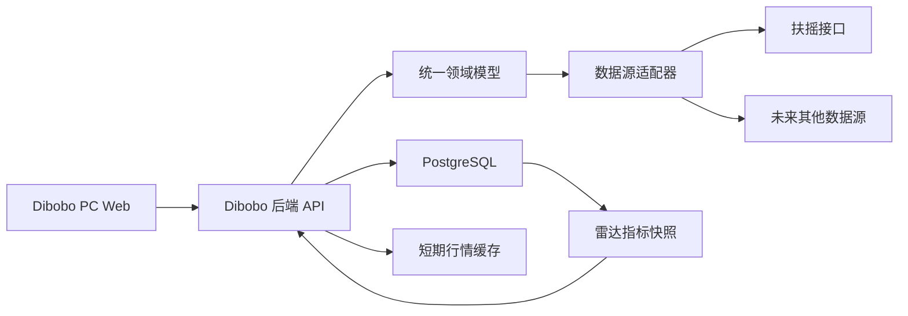

# Dibobo V1 产品需求文档（PRD）

| 文档属性 | 内容 |
|---|---|
| 产品名称 | Dibobo |
| 文档版本 | V1.2 |
| 需求状态 | 已确认，可进入设计与开发 |
| 文档日期 | 2026-07-31 |
| 目标终端 | PC Web |
| 目标市场 | 中国 A 股（股票及 ETF 持仓；红利雷达仅股票） |
| 部署方式 | 本地或自有服务器，Docker Compose 全容器化部署 |

## 1. 文档目的

本文档定义 Dibobo V1 的产品范围、页面功能、字段、业务规则、计算口径、权限与数据隔离、数据源适配方式、异常处理、非功能要求、部署要求和验收标准。

本文档作为产品、交互、前端、后端、测试和部署工作的共同需求基线。若实现方案与本文档冲突，以本文档中的业务规则和验收标准为准；技术实现可在不改变用户行为和数据语义的前提下调整。

## 2. 产品概述

### 2.1 产品定位

Dibobo 是一款面向个人投资者的 A 股低波红利策略数据工作台，主要用于：

- 查看核心宽基指数的最新行情；
- 管理用户手动录入的股票和 ETF 汇总持仓；
- 根据总市值、股息率、市净率和 ROE 筛选 A 股股票；
- 记录和回顾纯文本投资日记；
- 为每个用户独立配置金融数据源。

V1 的重点是完成稳定、可部署、可扩展的数据工作台，不包含 AI 对话、自动研报、智能推荐或交易决策功能。

### 2.2 目标用户

- 使用人数：单套部署预计 1～2 人；
- 用户类型：部署方预先创建的普通用户；
- 使用环境：本地电脑、家庭服务器或用户自有服务器；
- 使用方式：通过桌面浏览器访问 PC Web 页面。

### 2.3 V1 产品目标

1. 让不同用户安全地维护各自的持仓、日记和数据源配置；
2. 在交易时段提供约 5 秒频率的指数与持仓行情更新；
3. 提供可实际执行、结果可解释的红利指标筛选；
4. 通过数据源适配器隔离第三方接口差异，为后续新增供应商留出扩展空间；
5. 通过 Docker Compose 完成一键式私有化部署和数据持久化。

### 2.4 V1 不包含的范围

- 用户自主注册、找回密码和管理员管理页面；
- AI 对话、智能分析、自动点评、风险预测或交易建议；
- 券商连接、自动同步持仓、交易下单；
- 逐笔买卖流水、税费、佣金和已实现盈亏计算；
- ETF 红利雷达；
- 波动率、最大回撤等“低波”量化指标；
- 指数走势图或 K 线图；
- 自选股；
- 筛选方案保存；
- CSV、Excel 或其他结果导出；
- 任意 REST API 的可视化字段映射；
- 多数据源自动切换或同一结果中混合多源数据；
- 移动端专项设计和原生 App。

> 限制说明：虽然产品定位聚焦“低波红利”，V1 不计算波动率。“低波”属于产品后续演进方向，V1 的红利雷达只实现已确认的红利和基本面筛选指标。

## 3. 用户、权限与数据隔离

### 3.1 用户账号

- 系统不提供注册入口；
- 账号由部署人员通过初始化配置或后台命令创建；
- 登录凭证为用户名和密码；
- 用户名创建后不可由用户修改；
- 部署人员为账号设置初始密码；
- 首次登录不强制修改密码；
- 用户可在“系统设置 → 账号设置”中修改自己的密码。

### 3.2 权限范围

V1 只有普通用户角色，不提供网页管理员角色。登录用户只能：

- 访问自己的持仓和已清仓记录；
- 访问自己的投资日记；
- 访问和管理自己的数据源配置；
- 修改自己的密码；
- 查看使用自己当前数据源产生的行情和雷达数据。

### 3.3 数据隔离

所有用户数据表必须包含 `user_id` 或通过父实体与 `user_id` 建立不可绕过的归属关系。后端不得信任前端传入的 `user_id`，必须从当前登录会话中取得用户身份并自动附加查询条件。

需要隔离的数据至少包括：

- 当前持仓；
- 已清仓记录；
- 投资日记；
- 数据源配置及 API Key；
- 以用户数据源为维度同步的雷达指标快照；
- 用户会话。

## 4. 信息架构与页面路由

### 4.1 登录前页面

| 页面 | 建议路由 | 说明 |
|---|---|---|
| 登录 | `/login` | 用户名、密码登录 |

### 4.2 登录后页面

左侧固定一级菜单顺序如下：

| 菜单 | 建议路由 | 默认子视图 |
|---|---|---|
| 总览面板 | `/overview` | 四个指数卡片 |
| 持仓管理 | `/holdings` | 当前持仓 |
| 红利雷达 | `/radar` | 筛选条件与结果列表 |
| 投资日记 | `/journals` | 历史日记列表 |
| 系统设置 | `/settings` | 账号设置 |

登录成功后的默认落地页为“总览面板”。

### 4.3 全局布局

- 左侧：产品标识、五个一级菜单；
- 顶部：当前页面名称、行情数据状态、当前用户名、退出登录入口；
- 主内容区：页面内容；
- 全局底部或适当固定位置展示免责声明：“数据仅供参考，不构成任何投资建议”；
- PC 页面建议适配宽度不小于 1024 px，推荐设计基准为 1440 px；
- 不要求为手机宽度提供专用布局。

## 5. 全局业务与展示规则

### 5.1 时间与交易日

- 系统业务时区统一为 `Asia/Shanghai`；
- 日期展示格式：`YYYY-MM-DD`；
- 日期时间展示格式：`YYYY-MM-DD HH:mm:ss`；
- A 股交易时段按交易日历判断，通常为：
  - 上午：09:30:00～11:30:00；
  - 下午：13:00:00～15:00:00；
- 午间休市、收盘后、周末和节假日视为非连续刷新时段；
- 交易状态至少包含：`交易中`、`午间休市`、`已收盘`、`休市`、`未知`。

### 5.2 数值展示

- 币种统一为人民币 CNY；
- 上涨使用红色，下跌使用绿色，平盘或未知使用中性色；
- 百分比默认保留 2 位小数并显示 `%`；
- 金额默认保留 2 位小数；
- 股票价格遵循数据源精度，最多展示 4 位小数；
- 较大金额按以下规则格式化：
  - 绝对值小于 10,000：按元显示；
  - 10,000 及以上、100,000,000 以下：按万元显示；
  - 100,000,000 及以上：按亿元显示；
- 数据值为 `null`、缺失或无法计算时显示“暂无数据”，不得显示为 0；
- 数据来自缓存时仍需展示其原始数据时间，而不是页面获取时间。

### 5.3 通用页面状态

所有数据页面必须覆盖：

- 首次加载状态；
- 正常数据状态；
- 空数据状态；
- 数据源未配置状态；
- 数据源能力不支持状态；
- 数据源认证失败状态；
- 请求超时或数据源不可用状态；
- 使用最后成功缓存的过期数据状态；
- 后端内部错误状态。

错误提示应面向用户描述可执行动作，不直接暴露堆栈、数据库错误或 API Key。

### 5.4 删除规则

- 持仓、已清仓记录、投资日记和数据源配置的删除均需二次确认；
- V1 删除为永久删除，不提供回收站；
- 删除确认文案需包含待删除对象的可识别名称；
- 删除成功后应刷新当前列表并显示成功反馈。

## 6. 功能需求

## 6.1 登录、退出与会话

### 6.1.1 登录页面

#### 页面字段

| 字段 | 必填 | 规则 |
|---|---|---|
| 用户名 | 是 | 去除首尾空格；不区分或区分大小写由账号创建规则统一决定，推荐区分大小写 |
| 密码 | 是 | 密码输入框，不提供明文回显日志 |

#### 交互规则

1. 用户填写用户名和密码后点击“登录”；
2. 登录成功后进入 `/overview`；
3. 登录失败时统一提示“用户名或密码错误”，避免泄露账号是否存在；
4. 已登录用户访问 `/login` 时自动跳转 `/overview`；
5. 未登录用户访问任意登录后页面时跳转 `/login`；
6. 登录按钮在请求中不可重复点击。

### 6.1.2 会话规则

- 连续 24 小时无操作后会话失效；
- 用户发起受保护 API 请求视为操作；
- 会话失效后，当前请求返回未登录状态并跳转登录页；
- 用户主动退出后，当前会话立即失效；
- 修改密码成功后，该用户全部有效会话失效，并要求使用新密码重新登录；
- 推荐使用服务端会话或可撤销令牌，并通过 `HttpOnly`、`SameSite` Cookie 传递；
- 生产 HTTPS 环境必须启用 Cookie `Secure` 属性。

### 6.1.3 密码安全

- 密码长度至少 8 位；
- 必须同时包含字母和数字；
- 密码不得明文保存；
- 推荐使用 Argon2id 或 bcrypt 进行加盐哈希；
- 日志、错误信息和监控事件不得记录用户密码。

### 6.1.4 账号创建

部署包必须提供非交互配置或后台命令创建用户，推荐同时支持：

- 容器内命令：安全地传入用户名和初始密码；
- 首次部署初始化变量：仅用于首次初始化，完成后提示移除明文变量。

账号创建命令必须检查用户名重复和密码规则，并返回明确结果。

## 6.2 总览面板

### 6.2.1 页面目标

用四张卡片快速展示核心 A 股指数的最新行情，不展示走势图或用户个人资产。

### 6.2.2 固定指数

| 展示名称 | thscode |
|---|---|
| 上证指数 | `000001.SH` |
| 创业板指 | `399006.SZ` |
| 沪深300 | `000300.SH` |
| 科创50 | `000688.SH` |

指数不可由普通用户增加、删除或排序。

### 6.2.3 指数卡字段

| 字段 | 数据类型 | 说明 |
|---|---|---|
| 指数名称 | string | 使用产品内固定中文名称 |
| 最新点位 | decimal/null | 数据源最新点位 |
| 涨跌额 | decimal/null | 最新点位相对前收盘点位的变化 |
| 涨跌幅 | decimal/null | 百分数值 |
| 成交额 | decimal/null | 指数成交额，按元/万/亿元格式化 |
| 交易状态 | enum | 交易中、午间休市、已收盘、休市、未知 |
| 数据更新时间 | datetime/null | 数据源返回的行情时间 |

### 6.2.4 加载与刷新

- 进入页面后立即向 Dibobo 后端请求一次；
- 交易时段每 5 秒向 Dibobo 后端刷新一次；
- 四个指数应由后端批量向数据源请求；
- 非交易时段不连续轮询，只在进入页面或用户重新聚焦页面时请求一次；
- 浏览器标签页进入后台时应暂停前端轮询，重新可见时立即刷新；
- 请求失败时继续展示最后成功数据，并标记“数据可能已过期”；
- 数据源未配置时显示配置引导。

### 6.2.5 明确不展示

- 指数走势图或 K 线；
- 用户总资产、总盈亏或持仓摘要；
- 指数成分股；
- 指数估值。

## 6.3 持仓管理

### 6.3.1 页面结构

持仓管理页面由以下区域组成：

1. 当前持仓汇总卡片；
2. “新增持仓”按钮；
3. `当前持仓` 和 `已清仓` 两个页签；
4. 当前页签对应的数据表格。

### 6.3.2 当前持仓汇总

| 指标 | 计算规则 |
|---|---|
| 总成本 | 所有当前持仓的 `平均持仓成本 × 持股数量` 之和 |
| 总市值 | 所有具有有效最新价的当前持仓 `最新价 × 持股数量` 之和 |
| 总浮动盈亏 | 总市值 - 对应持仓成本 |
| 总浮动盈亏率 | 总浮动盈亏 ÷ 对应持仓成本 × 100% |

若部分当前持仓缺少最新价：

- 总成本仍展示全部当前持仓成本；
- 总市值、总盈亏和总盈亏率按可计算持仓汇总；
- 汇总区域必须标记“部分持仓行情缺失，汇总数据不完整”；
- 不得用 0 代替缺失最新价。

### 6.3.3 新增持仓字段

| 字段 | 必填 | 数据类型 | 校验规则 |
|---|---|---|---|
| 股票/ETF代码 | 是 | string | 必须从标的检索结果选择；持久化完整 `thscode` |
| 股票/ETF名称 | 是 | string | 与选中 `thscode` 对应，由系统自动填充 |
| 平均持仓成本 | 是 | decimal | 大于等于 0，最多 4 位小数 |
| 持股数量 | 是 | integer | 新增时必须大于 0 |
| 建仓日期 | 是 | date | 默认当天，不得晚于当天 |
| 备注 | 否 | string | 纯文本，建议上限 1,000 字符 |

### 6.3.4 代码与名称联动

- 代码和名称均可作为检索入口；
- 输入内容后调用标的检索能力并显示候选列表；
- 候选范围只允许 `a-share` 和 `fund-etf`；
- 用户选择候选项后同时填充代码和名称；
- 仅输入未选择候选项时不得保存；
- 代码或名称发生修改时，原有关联失效，必须重新选择；
- 持久化字段至少包括 `thscode`、`ticker`、`name`、`asset_type`、`exchange`。

### 6.3.5 当前持仓唯一性

- 同一用户、同一 `thscode` 同时只能存在一条当前持仓；
- 若用户新增已存在的当前持仓，系统提示其编辑原记录；
- 已清仓历史不参与当前持仓唯一性判断；
- 同一标的再次建仓时创建新的当前持仓，既有已清仓记录保持不变。

### 6.3.6 当前持仓表格

| 字段 | 来源/计算 |
|---|---|
| 代码 | 持仓记录 |
| 名称 | 持仓记录 |
| 标的类型 | 股票或 ETF |
| 平均持仓成本 | 用户录入 |
| 持股数量 | 用户录入 |
| 持仓成本金额 | 平均持仓成本 × 持股数量 |
| 最新价 | 当前数据源行情 |
| 当前市值 | 最新价 × 持股数量 |
| 浮动盈亏 | 当前市值 - 持仓成本金额 |
| 浮动盈亏率 | 浮动盈亏 ÷ 持仓成本金额 × 100% |
| 当日涨跌幅 | 当前数据源行情 |
| 持仓占比 | 当前市值 ÷ 全部可计算当前持仓总市值 × 100% |
| 建仓日期 | 用户录入 |
| 备注 | 用户录入 |
| 行情更新时间 | 数据源时间 |
| 操作 | 编辑、删除 |

当持仓成本金额为 0 时，浮动盈亏率显示“暂无数据”。当最新价缺失时，市值、浮动盈亏、浮动盈亏率和持仓占比均显示“暂无数据”。

当前持仓默认按当前市值从高到低排列；市值缺失的记录排在最后。

### 6.3.7 编辑与清仓

- 当前持仓允许编辑平均成本、数量、建仓日期和备注；
- 标的代码和名称不允许在编辑时替换，如需替换应删除后新增；
- 将持股数量修改为 0 并保存时：
  1. 弹出清仓确认；
  2. 将记录状态改为 `closed`；
  3. 自动记录清仓日期时间为操作发生时间；
  4. 从当前持仓和汇总中移除；
  5. 在已清仓页签中保留。
- V1 不录入卖出价格，因此不计算已实现盈亏。

### 6.3.8 已清仓记录

已清仓页签至少展示：

- 代码；
- 名称；
- 标的类型；
- 原平均持仓成本；
- 建仓日期；
- 清仓日期；
- 备注；
- 操作：编辑备注、删除。

已清仓记录默认按清仓日期从近到远排列。已清仓记录不得通过把数量改回正数的方式重新开仓；再次持有必须新增当前持仓。

### 6.3.9 行情刷新

- 当前持仓中的 A 股行情应尽量批量查询；
- ETF 按数据源能力批量或逐只查询，并由后端缓存；
- 交易时段每 5 秒刷新最新价、当日涨跌幅及所有派生指标；
- 编辑表单中的用户输入不得被行情刷新覆盖；
- 已清仓列表不需要行情轮询。

## 6.4 红利雷达

### 6.4.1 页面目标

根据用户设置的基本面与红利条件，从 A 股股票池中筛选并展示股票。V1 只做条件筛选和结果展示，不生成评分、推荐理由或投资建议。

### 6.4.2 股票池

初始股票池包括上海、深圳和北京证券交易所 A 股股票，不包括 ETF、LOF、场外基金和指数。

默认排除：

- ST；
- *ST；
- 退市整理或已退市标的；
- 暂停上市标的；
- 当前停牌标的；
- 长期停牌标的。

状态判断优先使用数据源适配器返回的标准化状态。若数据源缺少明确状态：

- ST、*ST 和退市整理可通过证券简称和已有状态字段进行补充判断；
- 当前停牌按数据源停牌状态或交易时段无有效行情判断；
- 长期停牌定义为最近 5 个已完成交易日均无有效日线记录；
- 无法可靠判断的标的需记录数据质量原因，不能静默伪造状态。

### 6.4.3 筛选条件

| 条件 | 输入方式 | 单位 | 数据规则 |
|---|---|---|---|
| 总市值 | 最小值、最大值 | 亿元 | 依赖数据源标准化总市值字段 |
| 股息率 | 最小值、最大值 | % | Dibobo 根据分红和最新价计算 |
| 市净率 PB | 最小值、最大值 | 倍 | 使用数据源 `pb_mrq` 或标准化等价字段 |
| ROE | 最小值、最大值 | % | 使用最新可用报告期的加权平均 ROE |

规则：

- 所有条件默认为空；
- 空值表示不限制；
- 同一条件的最小值不得大于最大值；
- 区间包含边界；
- 多个已填写条件之间使用 AND 关系；
- 点击“开始筛选”或“重新筛选”后执行；
- 提供“重置条件”操作，将所有条件恢复为空。

### 6.4.4 指标口径

#### 总市值

- 优先使用当前数据源直接提供并经适配器标准化的 `total_market_cap`；
- 若数据源只提供最新价和总股本，适配器可按 `最新价 × 总股本` 计算；
- 展示和筛选单位为亿元，内部建议以元存储；
- 当前扶摇股票基础信息/市值能力未就绪时，该筛选条件必须禁用，并显示“当前数据源暂不支持总市值”；
- 不允许用流通市值替代总市值而不做说明。

#### 股息率

计算公式：

```text
近12个月股息率 = 最近连续12个月每股税前现金分红合计 ÷ 筛选时点最新价 × 100%
```

规则：

- 现金分红取除息日在筛选时点向前连续 12 个月区间内的事件；
- 只累计 `dividend_per_share > 0` 的现金分红；
- 送股比例不计入现金股息率；
- 最新价缺失或小于等于 0 时股息率为“暂无数据”；
- 计算结果与所用分红事件、价格时间一并保存，便于追踪。

#### 市净率 PB

- 扶摇适配器使用估值快照的 `pb_mrq`；
- 负值按接口原值保留，不强制改为 `null`；
- 接口空值显示“暂无数据”；
- 页面不对 PB 做高估或低估判断。

#### ROE

- 扶摇适配器使用财务指标接口盈利能力分类中的 `index_weighted_avg_roe`；
- 使用适配器能够取得的最新有效报告期；
- 报告期格式保留为 `YYYY-Q1`、`YYYY-H1`、`YYYY-Q3` 或 `YYYY-FY` 等标准化展示值；
- 接口百分数原值按百分比展示，不再次乘以 100；
- ROE 与对应财报报告期必须同时返回；
- 不由 Dibobo 自行使用利润表和资产负债表重新计算 ROE。

#### 连续分红年数

- 以现金分红事件的除息日所在自然年统计；
- 只统计存在 `dividend_per_share > 0` 的年份；
- 若当前自然年已有现金分红，从当前年向前连续统计；
- 若当前自然年尚无现金分红，则从上一完整自然年向前连续统计；
- 当前年和上一年都无现金分红时结果为 0；
- 该字段只展示，不作为 V1 筛选条件。

### 6.4.5 缺失指标的三值筛选规则

用户已确认：缺失某项筛选指标的股票仍需进入结果。因此每个筛选条件按以下逻辑执行：

| 指标状态 | 条件判断结果 | 股票处理 |
|---|---|---|
| 有值且满足区间 | 通过 | 保留 |
| 有值但不满足区间 | 不通过 | 排除 |
| 缺失/无法计算 | 未知 | 保留，并标记“数据不完整” |

一只股票只要任一“有值指标”明确不满足条件，就应被排除。只有不存在明确失败条件、但至少一个参与筛选的指标缺失时，才作为“数据不完整”结果保留。

排序时：

1. 数据完整且满足条件的股票在前；
2. 数据不完整股票在后；
3. 两组内部再按用户选择的排序字段排序；
4. “暂无数据”始终位于对应排序组末尾。

### 6.4.6 结果字段

| 字段 | 说明 |
|---|---|
| 股票代码 | 纯代码和/或完整 thscode |
| 股票名称 | 最新标的名称 |
| 最新价 | 筛选后可进行行情刷新 |
| 当日涨跌幅 | 筛选后可进行行情刷新 |
| 总市值 | 亿元；不支持或缺失时显示暂无数据 |
| 股息率 | 近 12 个月税前现金股息率 |
| PB | MRQ 口径 |
| ROE | 最新有效报告期加权平均 ROE |
| 连续分红年数 | 自然年口径 |
| 财务报告期 | ROE 对应报告期 |
| 指标快照时间 | 雷达指标数据完成时间 |
| 行情更新时间 | 最新价对应时间 |
| 数据完整性 | 完整、数据不完整，并可查看缺失原因 |

### 6.4.7 排序与分页

- 初始排序为股息率从高到低；
- 最新价、涨跌幅、总市值、股息率、PB、ROE、连续分红年数均支持升降序；
- 默认每页 20 条；
- 翻页时保留筛选条件、筛选快照和排序；
- V1 不提供导出、自选股和筛选方案保存。

### 6.4.8 筛选快照与行情刷新

- 用户点击筛选时确定一次结果集合；
- 结果集合、指标值和筛选条件形成筛选快照；
- 交易时段每 5 秒只刷新当前结果页的最新价、涨跌幅和行情更新时间；
- 行情刷新不得自动增加或移除结果股票；
- 由最新价驱动的股息率或总市值也不改变当前筛选集合；
- 用户点击“重新筛选”后才使用最新雷达指标快照重新确定集合。

### 6.4.9 雷达数据同步要求

红利雷达不得在用户点击筛选时逐只同步请求全市场财务和分红接口。后端必须维护按数据源配置区分的本地雷达指标快照。

同步流程至少包括：

1. 同步 A 股代码表；
2. 同步或更新股票状态；
3. 分批同步估值快照；
4. 按数据源限流要求同步最新财务指标；
5. 增量同步现金分红事件；
6. 同步总市值或总股本能力（若数据源支持）；
7. 计算股息率和连续分红年数；
8. 生成可供本地筛选的完整快照；
9. 只有整批快照成功完成后才切换为新的可用版本，避免用户查询到半成品。

建议刷新频率：

- 标的代码表：每日一次；
- 股票状态：每个交易日更新；
- 估值：每个交易日收盘后更新，或遵循数据源更新时间；
- ROE：每日检查新报告期，数据本身按财报更新；
- 分红事件：每日增量更新；
- 雷达派生指标：底层数据成功更新后重算。

首次同步可能耗时较长。页面应展示：尚未同步、同步中、可用、部分失败、同步失败，以及最近一次完整快照时间。首次完整快照尚未完成时不得返回不完整的全市场筛选结果。

## 6.5 投资日记

### 6.5.1 页面结构

- 新建日记按钮；
- 日期查询条件；
- 历史日记列表；
- 日记新增/编辑表单；
- 分页控件。

### 6.5.2 日记字段

| 字段 | 必填 | 规则 |
|---|---|---|
| 日记日期 | 是 | 默认当天，可选择其他日期 |
| 标题 | 是 | 纯文本，去除首尾空格，建议 1～100 字符 |
| 正文 | 是 | 纯文本，建议 1～20,000 字符 |
| 创建时间 | 系统 | 首次保存时间，不可由用户修改 |
| 最后修改时间 | 系统 | 每次成功编辑后更新 |

同一用户在同一天可以创建多篇日记。

### 6.5.3 功能规则

- 支持手动保存；
- 支持查看完整内容；
- 支持编辑日期、标题和正文；
- 支持永久删除，删除前二次确认；
- 不支持富文本、Markdown 渲染、图片和附件；
- 不关联股票、ETF 或持仓；
- 不提供正文关键词搜索；
- 不提供版本历史和回收站。

### 6.5.4 查询与排序

- 支持按单个日期或日期范围查询；
- 默认展示全部历史记录；
- 默认按日记日期倒序，同一天按创建时间倒序；
- 默认每页 20 条；
- 查询和翻页后应保留日期条件。

### 6.5.5 空状态

- 当前用户从未创建日记：展示创建引导；
- 指定日期无结果：展示“该日期范围内没有投资日记”；
- 不得展示其他用户的日记数量或内容。

## 6.6 系统设置

系统设置包含“账号设置”和“数据源设置”两个模块。

### 6.6.1 账号设置

#### 字段

| 字段 | 必填 | 规则 |
|---|---|---|
| 原密码 | 是 | 必须验证正确 |
| 新密码 | 是 | 至少 8 位，同时包含字母和数字 |
| 确认新密码 | 是 | 必须与新密码一致 |

#### 规则

- 新密码不得与原密码完全相同；
- 修改成功后清除该用户全部会话并跳转登录页；
- 修改失败不得改变原密码；
- 密码字段不得进入前端持久化存储或日志。

### 6.6.2 数据源设置

#### 配置范围

- 数据源配置归当前用户所有；
- 每个用户可以保存多条配置；
- 同一用户同时只能启用一条配置；
- 不同用户可使用不同供应商、地址和 API Key；
- 数据源之间不自动故障切换。

#### 数据源字段

| 字段 | 必填 | 规则 |
|---|---|---|
| 数据源名称 | 是 | 当前用户内不可重复，建议 1～50 字符 |
| 数据源类型 | 是 | V1 至少支持“扶摇”及“扶摇兼容” |
| Base URL | 是 | 合法 HTTP/HTTPS 地址；生产环境推荐 HTTPS |
| API Key | 新增时是 | 服务端加密保存；编辑时留空表示不修改 |
| 是否启用 | 系统/操作 | 同一用户只能有一条启用记录 |
| 创建时间 | 系统 | 不可编辑 |
| 更新时间 | 系统 | 配置变更后更新 |

#### 列表展示

- 数据源名称；
- 数据源类型；
- Base URL；
- API Key 掩码，例如只显示末 4 位；
- 启用状态；
- 最近测试结果和时间；
- 操作：测试连接、编辑、启用、删除。

#### API Key 安全

- API Key 只能在提交时从浏览器传给后端；
- 后端使用部署级加密密钥进行可逆加密，以便调用第三方接口；
- 查询配置接口不得返回完整 API Key；
- 前端刷新或再次编辑时只显示固定掩码；
- 日志、异常、追踪和测试结果不得包含完整 API Key；
- 删除数据源时应同时删除其密钥密文和不再需要的用户级同步数据。

#### 测试连接

测试连接由对应适配器执行，至少验证：

1. Base URL 可访问；
2. API Key 鉴权成功；
3. 至少一个轻量级代表接口返回符合预期契约；
4. 记录响应耗时；
5. 返回适配器识别到的能力清单。

页面测试结果应包括：成功/失败、耗时、测试时间、用户可理解的原因。第三方返回的 `request_id` 可用于排障，但不得展示敏感响应内容。

#### 启用与删除

- 启用某条配置时自动停用该用户原启用配置；
- 启用前建议要求最近一次连接测试成功；
- 切换启用数据源后，总览、持仓行情和雷达均使用新数据源；
- 新数据源雷达快照未完成时，雷达显示同步状态，不复用旧数据源指标；
- 删除启用中的配置前必须明确提示其影响；
- 用户没有启用数据源时，所有外部数据页面展示配置引导，持仓和日记的用户数据仍可访问。

## 7. 数据源适配架构

### 7.1 设计原则

V1 不允许用户在界面中为任意 REST API 配置请求参数和响应字段映射。系统通过代码级适配器接入供应商：



新增供应商时，应实现统一适配器接口，而不是修改持仓、总览和红利雷达的业务代码。

### 7.2 标准化能力

适配器应声明是否支持以下能力：

| 能力标识 | 用途 | 扶摇 V1 状态 |
|---|---|---|
| `instrument_search` | 代码/名称联动 | 支持 |
| `instrument_list` | A 股和 ETF 代码表 | 支持 |
| `a_share_quote` | A 股行情 | 支持 |
| `etf_quote` | ETF 行情 | 支持，可能仅单只请求 |
| `index_quote` | 四个指数行情 | 支持 |
| `valuation_pb` | PB | 支持 |
| `financial_roe` | ROE | 支持，按报告期 |
| `corporate_action_dividend` | 现金分红事件 | 支持 |
| `total_market_cap` | 总市值 | 当前不支持/等待股票基础信息能力 |
| `instrument_status` | ST、退市、停牌状态 | 可能部分支持，需适配器补充判断 |

### 7.3 扶摇接口映射

V1 扶摇适配器至少对接：

| Dibobo 能力 | 扶摇接口 |
|---|---|
| 标的检索 | `GET /api/meta/tickers/search` |
| 标的列表 | `GET /api/meta/tickers/list` |
| A 股行情快照 | `GET /api/a-share/prices/snapshot` |
| ETF 行情快照 | `GET /api/fund/market/snapshot` |
| 指数行情快照 | `GET /api/a-share-index/prices/snapshot` |
| A 股历史日线 | `GET /api/a-share/prices/historical` |
| 估值快照 | `GET /api/a-share/valuations/snapshot` |
| 财务指标 | `GET /api/a-share/financials/indicators` |
| 现金分红事件 | `GET /api/a-share/corporate-actions/adjustment-factors` |
| 交易日历 | `GET /api/a-share/calendar/trading-days` |

扶摇业务成功不能只依赖 HTTP 状态码判断，必须检查统一响应信封中的 `code`。至少映射：

- `0`：成功；
- `2001`：API Key 无效；
- `2003`：权限不足；
- `3001`：标的不存在；
- `3002`：数据未就绪；
- `3004`：标的类型不支持；
- `4001`：频率超限；
- `5002`：上游超时；
- `5003`：上游不可用。

### 7.4 数据溯源

标准化行情和雷达指标应保留：

- 数据源配置 ID；
- 供应商标识；
- 第三方 `request_id`（如有）；
- 原始数据时间；
- Dibobo 获取时间；
- 指标报告期；
- 计算方式版本；
- 缺失或异常原因。

## 8. 数据模型建议

以下为逻辑模型，字段名可随技术栈调整，但约束和语义必须保留。

### 8.1 `users`

| 字段 | 类型 | 说明 |
|---|---|---|
| `id` | UUID/bigint | 主键 |
| `username` | varchar | 唯一用户名 |
| `password_hash` | varchar | 密码哈希 |
| `is_active` | boolean | 是否可登录 |
| `created_at` | timestamptz | 创建时间 |
| `updated_at` | timestamptz | 更新时间 |

### 8.2 `user_sessions`

| 字段 | 类型 | 说明 |
|---|---|---|
| `id` | UUID | 会话标识 |
| `user_id` | FK | 用户 |
| `expires_at` | timestamptz | 绝对过期时间 |
| `last_active_at` | timestamptz | 最后活动时间 |
| `revoked_at` | timestamptz/null | 撤销时间 |
| `created_at` | timestamptz | 创建时间 |

### 8.3 `data_sources`

| 字段 | 类型 | 说明 |
|---|---|---|
| `id` | UUID/bigint | 主键 |
| `user_id` | FK | 所属用户 |
| `name` | varchar | 用户内唯一名称 |
| `provider_type` | varchar | `fuyao`、`fuyao_compatible` 等 |
| `base_url` | varchar | Base URL |
| `api_key_ciphertext` | text | 加密后的 API Key |
| `api_key_last4` | varchar | 掩码展示使用 |
| `is_active` | boolean | 当前启用 |
| `last_test_status` | varchar/null | 最近测试状态 |
| `last_test_latency_ms` | integer/null | 最近测试耗时 |
| `last_test_at` | timestamptz/null | 最近测试时间 |
| `capabilities` | jsonb | 最近识别到的能力 |
| `created_at` | timestamptz | 创建时间 |
| `updated_at` | timestamptz | 更新时间 |

约束：同一用户只能有一条 `is_active=true` 的记录。

### 8.4 `positions`

| 字段 | 类型 | 说明 |
|---|---|---|
| `id` | UUID/bigint | 主键 |
| `user_id` | FK | 所属用户 |
| `thscode` | varchar | 完整标的代码 |
| `ticker` | varchar | 纯代码 |
| `name` | varchar | 标的名称快照 |
| `asset_type` | varchar | `a_share` 或 `fund_etf` |
| `exchange` | varchar | SH、SZ、BJ |
| `average_cost` | decimal | 平均成本 |
| `quantity` | bigint | 当前数量；已清仓为 0 |
| `opened_on` | date | 建仓日期 |
| `note` | text/null | 备注 |
| `status` | varchar | `open`、`closed` |
| `closed_at` | timestamptz/null | 清仓时间 |
| `created_at` | timestamptz | 创建时间 |
| `updated_at` | timestamptz | 更新时间 |

约束：同一用户与 `thscode` 最多一条 `status=open` 记录。

### 8.5 `journals`

| 字段 | 类型 | 说明 |
|---|---|---|
| `id` | UUID/bigint | 主键 |
| `user_id` | FK | 所属用户 |
| `journal_date` | date | 日记日期 |
| `title` | varchar | 标题 |
| `content` | text | 纯文本正文 |
| `created_at` | timestamptz | 创建时间 |
| `updated_at` | timestamptz | 修改时间 |

### 8.6 `radar_snapshots`

| 字段 | 类型 | 说明 |
|---|---|---|
| `id` | UUID/bigint | 快照版本 |
| `data_source_id` | FK | 对应用户数据源 |
| `status` | varchar | building、ready、failed |
| `as_of` | timestamptz | 快照业务时间 |
| `calculation_version` | varchar | 派生指标算法版本 |
| `started_at` | timestamptz | 同步开始时间 |
| `completed_at` | timestamptz/null | 完成时间 |
| `error_summary` | text/null | 失败摘要，不含密钥 |

### 8.7 `radar_metrics`

| 字段 | 类型 | 说明 |
|---|---|---|
| `snapshot_id` | FK | 快照版本 |
| `thscode` | varchar | 股票代码 |
| `ticker` | varchar | 纯代码 |
| `name` | varchar | 股票名称 |
| `exchange` | varchar | 交易所 |
| `security_status` | varchar/null | 正常、ST、停牌等 |
| `total_market_cap` | decimal/null | 元 |
| `dividend_yield_ttm` | decimal/null | 百分数原值 |
| `pb_mrq` | decimal/null | PB |
| `roe_weighted` | decimal/null | 百分数原值 |
| `roe_report_period` | varchar/null | ROE 报告期 |
| `consecutive_dividend_years` | integer/null | 连续分红年数 |
| `metric_time` | timestamptz/null | 指标时间 |
| `missing_reasons` | jsonb | 缺失原因集合 |

建议主键：`snapshot_id + thscode`。

## 9. Dibobo 后端 API 建议

内部 API 路径可调整，功能边界建议如下。

### 9.1 认证

- `POST /api/auth/login`
- `POST /api/auth/logout`
- `GET /api/auth/me`
- `POST /api/auth/change-password`

### 9.2 总览

- `GET /api/overview/indices`

### 9.3 持仓

- `GET /api/holdings?status=open|closed`
- `GET /api/holdings/summary`
- `POST /api/holdings`
- `PATCH /api/holdings/{id}`
- `DELETE /api/holdings/{id}`
- `GET /api/instruments/search?q=...&asset_type=...`

### 9.4 红利雷达

- `GET /api/radar/status`
- `POST /api/radar/search`
- `GET /api/radar/quotes?search_id=...&page=...`

筛选请求建议使用 POST，以结构化 JSON 传递区间、分页和排序，同时返回不可变的 `search_id` 或等价筛选快照标识。

### 9.5 投资日记

- `GET /api/journals?date_from=...&date_to=...&page=...`
- `POST /api/journals`
- `GET /api/journals/{id}`
- `PATCH /api/journals/{id}`
- `DELETE /api/journals/{id}`

### 9.6 数据源

- `GET /api/settings/data-sources`
- `POST /api/settings/data-sources`
- `PATCH /api/settings/data-sources/{id}`
- `DELETE /api/settings/data-sources/{id}`
- `POST /api/settings/data-sources/{id}/test`
- `POST /api/settings/data-sources/{id}/activate`

所有资源 ID 查询必须同时校验资源归属当前用户。

## 10. 行情刷新、缓存与限流

### 10.1 前端刷新

- 总览面板：交易时段 5 秒；
- 当前持仓：交易时段 5 秒；
- 红利雷达当前结果页行情：交易时段 5 秒；
- 已清仓、日记和设置：不轮询；
- 浏览器页面不可见时暂停轮询；
- 页面重新可见时立即请求一次。

### 10.2 后端缓存

第三方行情不得由每个浏览器请求直接透传。后端应按以下维度合并和缓存：

- 数据源配置；
- 标的类型；
- 标的代码集合；
- 数据时间。

建议行情缓存有效期接近 5 秒，使同一用户多个页面或短时间重复请求可以复用结果。不得跨不同数据源配置混用缓存。

### 10.3 频率超限

收到第三方频率超限后：

1. 保留最后一次成功数据；
2. 标记行情过期；
3. 采用递增间隔重试，例如 10 秒、30 秒、60 秒；
4. 成功后逐步恢复目标刷新频率；
5. 不允许多个页面同时无控制地立即重试；
6. 记录不含敏感信息的限流日志。

### 10.4 数据源失败

- API Key 无效或权限不足：停止高频重试，并引导用户检查数据源设置；
- 上游超时：按退避策略重试；
- 上游不可用：保留缓存并显示过期；
- 单只标的数据缺失：只标记该标的，不使整个页面失败；
- 不自动切换到其他数据源。

## 11. 非功能需求

### 11.1 性能

在推荐部署配置、1～2 名并发用户和第三方接口正常的前提下：

- 登录后普通页面首屏目标 2 秒内可用；
- 缓存命中的行情请求目标 500 ms 内返回；
- 已完成雷达快照上的筛选请求目标 2 秒内返回第一页；
- 持仓和日记 CRUD 目标 1 秒内返回；
- 用户操作期间不得因后台雷达同步阻塞持仓和日记功能。

外部数据源耗时不计入本地接口纯处理时间，但必须有明确超时和降级机制。

### 11.2 兼容性

- 支持当前及前一个主要版本的 Chrome 和 Edge；
- PC 最低有效宽度建议 1024 px；
- 不保证移动浏览器完整体验；
- 所有文本必须支持 UTF-8 中文。

### 11.3 安全

- 密码使用安全哈希；
- API Key 使用部署级密钥加密；
- 所有 SQL 查询必须参数化；
- 防止越权访问其他用户资源；
- 生产部署使用 HTTPS；
- Cookie 使用 `HttpOnly` 和合适的 `SameSite`；
- 修改类接口应具备 CSRF 防护或使用同等安全机制；
- 日志不得输出密码、完整 API Key、会话令牌；
- 登录失败应限速，建议同一账号或来源连续失败后短时限制；
- 富文本未启用，日记仍需进行安全转义以防 XSS。

### 11.4 可靠性

- PostgreSQL 数据必须存放于持久化卷；
- 服务重启不得丢失用户、持仓、日记和数据源配置；
- 雷达同步采用新快照构建完成后原子切换；
- 后台任务失败不得破坏上一份可用快照；
- 所有容器应提供健康检查；
- 后端启动时应检查数据库迁移状态和加密密钥配置。

### 11.5 可观测性

日志至少覆盖：

- 服务启动与关闭；
- 登录成功、失败和退出（不记录密码）；
- 持仓、日记和数据源的新增、修改、删除事件；
- 数据源连接测试结果；
- 外部接口错误码、耗时和 request_id；
- 雷达同步开始、进度、完成和失败；
- 限流和退避状态。

日志需包含时间、级别、请求追踪 ID 和用户 ID（适用时），不得包含敏感字段。

### 11.6 备份与恢复

- 提供 PostgreSQL 数据卷或逻辑备份说明；
- 推荐支持管理员通过容器命令执行备份和恢复；
- 备份范围必须包括用户数据和加密后的数据源配置；
- 恢复环境必须使用原部署加密密钥，否则 API Key 无法解密；
- V1 不要求在网页中提供备份功能。

## 12. 技术栈与 Docker Compose 部署要求

### 12.1 技术栈基线

V1 采用前后端分离的 PC Web 架构。以下为开发、测试和部署的默认技术基线；允许在同一主版本内升级补丁版本，升级主要版本或更换核心组件时必须进行兼容性评估并记录变更。

| 层级 | 技术选型 | V1 使用要求 |
|---|---|---|
| 前端语言与框架 | React 19.x、TypeScript、Vite | 构建单页应用（SPA）；V1 不要求 SSR 或 SEO |
| 前端路由 | React Router | 管理登录页和登录后的各模块路由及访问保护 |
| UI 基础 | shadcn/ui、Tailwind CSS、Radix UI | 采用 shadcn/ui 的 Radix 版本构建项目自有组件体系，用于 PC 端布局、表单、筛选器、弹窗和状态反馈 |
| 数据表格 | TanStack Table | 作为持仓和红利雷达表格内核，实现服务端分页、排序、列定义和行操作 |
| 服务端状态 | TanStack Query | 负责接口请求、缓存、请求去重、失败重试及交易时段 5 秒轮询 |
| 前端本地状态 | Zustand | 仅管理必要的跨页面客户端状态，不重复保存后端业务数据 |
| 表单与校验 | React Hook Form、Zod | 实现录入体验和前端即时校验；后端仍须独立完成全部安全与业务校验 |
| 后端语言与框架 | Python 3.13、FastAPI、Pydantic 2.x | 提供 REST JSON API、统一参数校验、OpenAPI 文档和数据源适配能力 |
| 数据访问 | SQLAlchemy 2.x、Alembic | 使用 ORM/参数化查询访问数据库，并通过迁移脚本管理结构变更 |
| 主数据库 | PostgreSQL 18.x | 保存用户、会话、数据源配置、持仓、日记、雷达快照和同步任务状态 |
| 后台任务 | Celery 5.x、Celery Beat | 执行雷达全市场同步、定时更新、失败重试和快照构建；不得承载前端每 5 秒行情轮询 |
| 缓存与消息代理 | Valkey 8.x | 保存可重建的短期行情缓存、限流状态，并作为后台任务消息代理 |
| Web 网关 | Nginx | 提供前端静态资源、统一访问入口、API 反向代理及生产环境 TLS 终止 |
| 容器编排 | Docker Compose | 支持本地和自有服务器全容器化部署 |

开发工具默认使用 Node.js 当前 LTS 版本和 `pnpm` 管理前端依赖，使用 `uv` 管理 Python 环境与依赖。依赖版本必须通过锁文件固定；生产构建不得在容器启动时临时获取未锁定依赖。

### 12.2 工程架构约束

- 前端采用 SPA，通过后端 API 获取业务数据；生产环境由 Nginx 提供构建后的静态资源；
- shadcn/ui 组件源码必须纳入项目版本控制，统一放置于前端基础 UI 组件目录；引入或更新上游组件时必须评审代码差异，不得无审查覆盖本地定制；
- V1 的基础 UI 体系统一使用 shadcn/ui，不得同时引入 Ant Design 等完整 UI 组件库；确有缺失能力时应优先基于 Radix UI 或无样式组件进行封装；
- 持仓和红利雷达必须复用项目级数据表格封装，统一处理服务端分页、排序、加载、空状态、缺失值、数值右对齐和行操作；
- 前端应封装可复用的金融业务展示组件，至少包括证券代码与名称展示、金额、百分比、涨跌状态、指标缺失状态和数据更新时间；
- 后端采用模块化单体，不为账号、持仓、雷达、日记和设置分别拆分微服务；
- 后端代码至少按认证与用户、持仓、行情与数据源适配、红利雷达、投资日记、系统设置、后台任务、公共基础设施进行模块划分；
- 普通业务接口使用 REST JSON，并生成可访问的 OpenAPI 文档；
- 浏览器身份认证采用服务端会话和安全 Cookie；V1 不以 JWT 作为浏览器会话的默认实现；
- 业务模块只能通过统一数据源适配接口访问第三方供应商，不得在页面接口或领域服务中直接耦合扶摇响应字段；
- 用户、持仓、日记、数据源配置及雷达指标等结构化数据必须以 PostgreSQL 为最终持久化来源；不得仅保存在浏览器、进程内存或 Valkey；
- Valkey 中的数据必须视为可重建数据，缓存丢失不得造成用户业务数据永久丢失；
- API、后台任务和调度器可共用同一后端代码与容器镜像，但必须以独立进程和独立 Compose 服务运行；
- 交易时段 5 秒行情刷新由前端请求后端、后端合并请求并读取或更新短期缓存完成，不通过 Celery 为每次页面刷新创建任务；
- 全市场财务、估值、分红数据同步及雷达快照构建必须在后台 Worker 中执行，不得占用 API 请求进程执行长任务；
- V1 不引入微服务治理、Kubernetes、Kafka、Elasticsearch 或独立时序数据库。

### 12.3 服务组成

生产环境 Docker Compose 至少包含：

| 服务 | 职责 |
|---|---|
| `web` | Nginx、PC Web 静态资源、统一入口、API 反向代理和可选 TLS 终止 |
| `api` | FastAPI 业务接口、会话校验、行情聚合、数据源适配器和短期缓存读写 |
| `worker` | Celery Worker，执行雷达同步、快照构建和失败重试 |
| `scheduler` | Celery Beat，仅负责任务调度，不执行具体同步工作 |
| `postgres` | 用户业务数据、雷达快照和同步任务状态持久化 |
| `valkey` | 短期行情缓存、限流状态和 Celery 消息代理 |

`api`、`worker` 和 `scheduler` 应从同一个后端应用镜像启动不同命令，避免形成三套代码。单套部署只允许一个 `scheduler` 实例；`worker` 默认并发数应适配小型服务器资源，并可通过环境变量调整。

### 12.4 持久化卷

至少包含：

- PostgreSQL 数据卷；
- 可选 Valkey 数据卷；
- 可选日志卷；
- 可选备份目录。

删除或重建应用容器不得删除数据库卷。Valkey 不得作为用户数据或雷达可用快照的唯一存储；未配置 Valkey 持久化时，系统重启后必须能从 PostgreSQL 和第三方数据源恢复缓存与待执行同步状态。

### 12.5 环境变量

至少定义：

- 数据库连接信息；
- Valkey 连接信息；
- 应用会话密钥；
- API Key 加密密钥；
- 应用公开地址；
- 时区 `Asia/Shanghai`；
- 日志级别；
- 可配置行情目标刷新周期，默认 5 秒；
- 可配置第三方请求超时与并发限制；
- 可配置 Worker 并发数、任务超时和雷达同步计划；
- 可选首次初始化用户信息。

生产环境不得把真实密钥提交到代码仓库。应提供 `.env.example`，只包含变量名和安全说明。

### 12.6 启停、构建与迁移

- `docker compose up -d` 应能启动完整系统；
- 前端和后端生产镜像必须使用锁文件进行可复现构建；
- 数据库迁移应在后端正式对外服务前完成；
- 初始化用户命令应有清晰说明；
- `api`、`worker`、`scheduler`、`postgres` 和 `valkey` 均应提供健康检查或等价的就绪判断；
- `docker compose down` 不得默认删除持久化卷；
- 升级文档需说明备份、迁移和回滚步骤。

## 13. 验收标准

### 13.1 账号与权限

1. 部署人员可通过命令创建符合密码规则的用户；
2. 系统没有注册和找回密码入口；
3. 正确账号可登录，错误账号或密码不能登录；
4. 24 小时无操作后会话失效；
5. 用户修改密码后全部会话失效；
6. 用户 A 无法读取、修改或删除用户 B 的持仓、日记和数据源；
7. API 返回和日志中不出现完整密码、API Key 或会话令牌。

### 13.2 总览面板

1. 页面固定展示四个确认指数及正确代码；
2. 每张卡展示点位、涨跌额、涨跌幅、成交额、状态和更新时间；
3. 页面不展示指数走势图和个人资产摘要；
4. 交易时段按约 5 秒刷新；
5. 非交易时段不持续轮询；
6. 请求失败时保留最后成功值并明确显示过期状态；
7. 上涨红、下跌绿、平盘中性。

### 13.3 持仓管理

1. 可通过代码或名称检索 A 股和 ETF，选择后双向填充；
2. 未选择有效候选项不能保存；
3. 可新增、编辑和删除当前持仓；
4. 同一用户同一标的不能存在两条当前持仓；
5. 表格正确计算成本、市值、盈亏、盈亏率和占比；
6. 页面顶部正确汇总当前持仓；
7. 行情缺失时显示暂无数据，不以 0 替代，并标记汇总不完整；
8. 数量改为 0 后记录进入已清仓并自动产生清仓时间；
9. 已清仓记录不参与当前汇总；
10. 再次买入同一标的可创建新持仓且不覆盖旧清仓记录；
11. 当前持仓交易时段按约 5 秒刷新，已清仓不轮询；
12. V1 不显示已实现盈亏。

### 13.4 红利雷达

1. 股票池只包含沪、深、北 A 股，不包含 ETF；
2. 按规则排除 ST、*ST、退市整理、暂停上市和停牌标的；
3. 支持总市值、股息率、PB、ROE 的最小/最大值输入；
4. 多条件以 AND 执行，区间包含边界；
5. 当前数据源不支持总市值时条件禁用并明确提示；
6. 股息率按最近 12 个月税前每股现金分红与最新价计算；
7. PB 使用 MRQ 接口值；
8. ROE 使用最新有效报告期接口值并展示报告期；
9. 连续分红年数按确认的自然年规则计算；
10. 已知指标不满足条件的股票被排除；
11. 缺失参与筛选指标的股票仍进入结果并标记数据不完整；
12. 数据不完整股票排列在完整股票之后；
13. 默认按股息率降序，每页 20 条；
14. 所有确认数值列可排序；
15. 筛选后只刷新当前结果页行情，不自动改变入选集合；
16. 重新筛选后使用最新完整雷达快照；
17. 首次同步未完成时展示状态，不返回半成品全市场结果；
18. V1 不出现波动率、评分、推荐、导出、自选或保存方案功能。

### 13.5 投资日记

1. 同一天可新增多篇纯文本日记；
2. 日记包含日期、标题、正文、创建时间和修改时间；
3. 可编辑和永久删除；
4. 删除前二次确认；
5. 可按日期或日期范围查询；
6. 默认按日记日期和创建时间倒序；
7. 不提供关键词搜索、富文本、附件和股票关联；
8. 用户之间的日记完全隔离。

### 13.6 系统设置

1. 修改密码需要原密码、新密码和确认密码；
2. 新密码至少 8 位且同时包含字母和数字；
3. 每个用户可保存多条独立数据源配置；
4. 每个用户同时只能启用一条数据源；
5. 可新增、编辑、删除、启用和测试连接；
6. 测试连接显示状态、耗时、时间和错误原因；
7. API Key 查询时只返回掩码；
8. 切换数据源后不混用旧源雷达指标；
9. 无启用数据源时，外部数据页面给出配置引导，用户本地数据仍可访问；
10. V1 不提供任意 REST 字段映射和自动故障切换。

### 13.7 部署

1. `web`、`api`、`worker`、`scheduler`、`postgres` 和 `valkey` 可通过 Docker Compose 启动；
2. 前端、API、后台任务、任务调度、数据库、缓存和反向代理均运行在容器中；
3. 容器重建后用户数据不丢失；
4. 提供健康检查、环境变量示例、初始化账号命令和备份说明；
5. 生产密钥不写入镜像和代码仓库；
6. 单套部署支持 1～2 名用户正常使用且后台同步不阻塞主要功能；
7. 前后端生产依赖由锁文件固定，实际构建结果符合第 12.1 节技术栈基线；
8. 雷达同步由独立 Worker 执行且只运行一个调度器，页面 5 秒行情刷新不创建 Celery 任务。

## 14. 发布前检查清单

- [ ] 登录、退出、会话过期和修改密码流程通过；
- [ ] 两个测试用户的数据隔离测试通过；
- [ ] 四个指数代码与字段映射通过；
- [ ] A 股和 ETF 持仓行情映射通过；
- [ ] 持仓公式、0 成本、行情缺失和清仓边界测试通过；
- [ ] 雷达完整快照可构建、原子切换并可查询；
- [ ] 雷达三值筛选逻辑与缺失排序通过；
- [ ] 股息率和连续分红年数样例核算通过；
- [ ] 当前数据源缺失总市值能力时正确禁用；
- [ ] 投资日记日期查询与跨用户隔离通过；
- [ ] 数据源 API Key 加密、掩码和日志脱敏通过；
- [ ] 交易时段刷新、非交易时段停轮询和页面隐藏暂停通过；
- [ ] 第三方限流、认证失败、超时和不可用降级通过；
- [ ] 技术栈、模块化单体边界及 API/Worker/Scheduler 进程拆分符合第 12 节要求；
- [ ] Docker Compose 全新环境安装和已有数据升级通过；
- [ ] 数据库备份与恢复演练通过；
- [ ] 页面展示“数据仅供参考，不构成任何投资建议”。

## 15. 后续版本候选方向

以下仅作为演进方向，不属于 V1 验收范围：

- 20/60/120/250 日波动率与低波筛选；
- 最大回撤、Beta、夏普比率；
- 连续多年股息率、分红增长率和分红稳定性；
- 行业过滤与行业内排序；
- 自选股、筛选方案保存和数据导出；
- 逐笔交易、已实现盈亏和资产收益曲线；
- 券商或文件导入持仓；
- 更多数据源适配器；
- AI 持仓分析、筛选解释、投资日记总结和风险提示。

---

本文件记录的 V1 需求已经产品确认。开发过程中若需要改变业务范围、指标口径、用户可见行为或验收标准，应先形成变更记录并重新确认。
